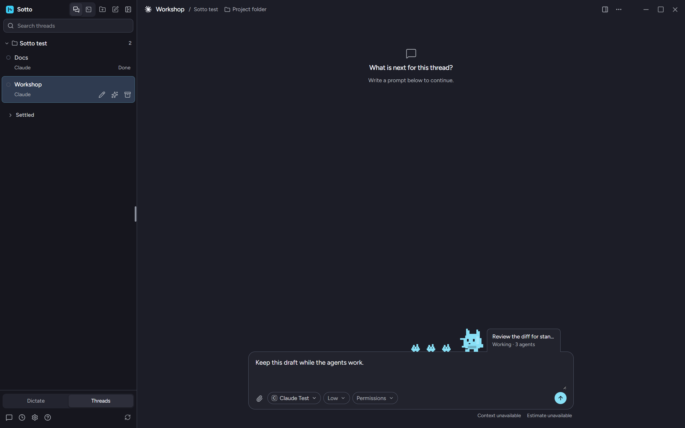

<div align="center">


# Sotto

**One desktop window for your Claude Code, Codex, Grok Build and Devin threads, with dictation that types anywhere.**

[](https://github.com/millZach/Sotto-releases/releases/latest)
[](#requirements)
[](LICENSE.md)

**[Download the latest installer or disk image](https://github.com/millZach/Sotto-releases/releases/latest)**


</div>

---

Sotto runs the coding agents you already have installed. It gives every thread a place in one sidebar, puts a browser, terminal, file browser and diff viewer beside it, and handles the Git work from a single button. When you would rather talk than type, press the global shortcut anywhere on your computer, speak, and Sotto types what you said.

It is free, open source under the MIT license, and has no account, no analytics and no crash upload. Your agents run on your own sign-ins. Dictation runs on your own OpenRouter key.

> [!NOTE]
> Sotto is in beta. The Threads page is the page Sotto opens on and the part that changes fastest. Remote hosts are a development feature. The voice coordinator and memory are built but switched off for the beta.

## Contents

- [Threads](#threads)
- [Tools beside every thread](#tools-beside-every-thread)
- [Git and worktrees](#git-and-worktrees)
- [Remote hosts](#remote-hosts)
- [Dictation](#dictation)
- [Requirements](#requirements)
- [Install](#install)
- [Privacy and cost](#privacy-and-cost)
- [Build from source](#build-from-source)
- [Documentation](#documentation)
- [License](#license)

## Threads

A **thread** is one conversation with a coding agent about a project folder. Sotto drives the agent's own command-line client, so the client keeps its own sign-in, models and billing, and Sotto keeps the thread.

| Provider | How Sotto talks to it | Notes |
| --- | --- | --- |
| **Claude Code** | stream-json | Screenshots; shows its monitoring tasks and background agents |
| **Codex** | App Server | Screenshots on models that accept images; questions with choices |
| **Grok Build** | ACP (CLI 1.0.5 or newer) | No screenshots through its client yet |
| **Devin** | Devin CLI (3000.10.31 or newer) | Tested on Windows; Apple silicon is not yet verified |

- **Connect any of them, together.** Each provider has its own switch in **Settings → Providers**. A thread's model decides which client runs it, and the same folder can have threads on different providers.
- **You answer every permission.** A request that the thread's permissions do not already cover waits for you. A question with choices shows above the message bar, with the model's suggestion marked but not picked.
- **Steer, queue and interrupt.** Queue messages while a thread works, and press **Steer now** to send one into the current turn where the provider supports it.
- **Choose the model, effort and permissions** from the chips under the message box. The effort chip slides between the levels the model supports.
- **Paste screenshots.** Up to eight images, 10 MB each and 20 MB in total, on models that accept them.
- **History is Sotto's own.** A thread's messages live in `threads.sqlite` in Sotto's data folder. Turn off **Keep local history** and no message text is written to disk.
- **Chats** are conversations with no project folder.
- **Client updates.** Sotto tells you when Claude Code, Codex or Grok Build has a newer version and installs it with one press.

<div align="center">

<br />
<sub>On Claude Code threads, a small pixel creature shows the background agents still working after the turn has ended.</sub>
</div>

## Tools beside every thread

Open **Tools** from a thread's header. The panel's rail holds five surfaces:

| Surface | What it does |
| --- | --- |
| **Browser** | A browser inside Sotto. Codex, Claude Code and Grok Build can use it to check a page. Clicks and typing always wait for your answer, and so does opening a page unless you let that thread open pages freely. |
| **Terminal** | A real terminal in the thread's working copy. |
| **Files** | Browse and preview the working copy. |
| **Changes** | The diff: the working tree, the whole branch against its base, or any single turn. Stacked or split views. `Ctrl+D` (`⌘D` on a Mac) opens and closes it. |
| **Agents** | The subagents a thread started, with their task, model, status and result. |

## Git and worktrees

- **One button for what the folder needs next.** The Git action at the end of the pane header says what the folder needs and does it from one press: **Commit**, **Commit & push**, **Commit, push & PR**, **Push**, **Push & create PR**, **Pull**, **Sync ref**, **Create PR**, **View PR**, **Publish repository** or **Initialize Git**.
- **Messages written for you.** Leave the commit message empty and the thread's own provider writes it in the repository's style. Pull request text, thread titles and new branch names are written the same way. None of it goes through OpenRouter.
- **Worktrees when you want them.** New threads share the project folder by default. Pick **New worktree** under the message box for independent parallel work on its own branch.
- **Worktrees have an end.** **Remove worktree** gives the disk space back and keeps the branch. Optional rules remove clean worktrees on their own: after days idle, when the thread is settled, when its commits are in the default branch, or when its pull request is merged. All of them are off until you turn one on.

## Remote hosts

*Development feature.*

Run threads on another machine you reach over SSH and have installed the Sotto host on. In **Settings → Hosts**, press **Add host** and type an SSH host or alias. Sotto starts the host there, forwards its loopback port through your SSH connection and pairs this computer. Threads from every connected host share one sidebar, marked with their host's name. Provider sign-ins stay on the host. Dictation and paste stay on your desktop.

The host runs under Node 24 on Linux or Windows, without Electron or a display. See the [guide](docs/guide.md#remote-hosts) for setup, pairing and version rules.

## Dictation


Press `Ctrl+Shift+Space` (`⌃⇧Space` on a Mac) in any app, speak, and press it again. Sotto copies the transcript to the clipboard and can paste it at your cursor. `Escape` cancels.

- **Transcribed by Microsoft MAI-Transcribe-2** through OpenRouter, on your own key.
- **Your dictionary spells names right.** Up to 200 entries from your personal dictionary go with each request as spelling hints.
- **Long dictations finish fast.** Streaming transcription, on by default, transcribes as you speak.
- **Optional AI cleanup** fixes punctuation, fillers and self-corrections with the same key. It is off by default. When it is slow or offline, you get the raw transcript.
- **The clipboard always has it.** When paste is blocked, Sotto says **Copied — paste manually** and the text is waiting.

<br clear="right" />

## Requirements

| | Windows | macOS |
| --- | --- | --- |
| **System** | Windows 10 or 11, x64 | macOS 12 or newer on Apple silicon; Intel Macs are not supported |
| **For threads** | Claude Code, Codex, Grok Build or Devin installed and signed in | Same |
| **For dictation** | A microphone, an [OpenRouter API key](https://openrouter.ai/keys) and an internet connection | Same, plus Automation and Accessibility permission for automatic paste |
| **Disk** | At least 1 GB of free space during installation | At least 1 GB free while the disk image is mounted and copied |

macOS 12 is the oldest version the Electron release Sotto is built on supports.

## Install

### Windows

Run `Sotto Setup <version>.exe` from the [latest release](https://github.com/millZach/Sotto-releases/releases/latest). It installs for your user only. The desktop shortcut is optional and unchecked by default; the installer always creates a Start Menu shortcut. Uninstalling keeps your settings and history unless you choose otherwise.

The installer is not code-signed, so Windows may show **Unknown publisher** or a SmartScreen prompt. The installed app checks GitHub for new versions and offers them from the update control in the sidebar foot.

### macOS

1. Open `Sotto-<version>-arm64.dmg`, drag **Sotto** onto **Applications**, eject the disk image and launch Sotto from Applications.
2. Sotto is not signed with an Apple Developer ID, so macOS refuses the first launch. Open **System Settings → Privacy & Security** and press **Open Anyway** beside the message about Sotto. Or clear the quarantine flag in Terminal:

   ```bash
   xattr -dr com.apple.quarantine /Applications/Sotto.app
   ```

3. Grant microphone access on your first dictation, and Automation and Accessibility on your first automatic paste. macOS asks again after every update, because each build has a new signature.

New versions for macOS are downloaded by hand from the releases page.

### First run

Setup explains what leaves the computer, tests the microphone, takes your OpenRouter key (you can add it later in Settings) and shows the shortcut. Sotto then opens on Threads. Connect a provider in **Settings → Providers**, add a project folder, and start a thread.

Closing the window leaves Sotto in the Windows notification area or the macOS menu bar.

## Privacy and cost

Sotto has no account, no analytics and no crash upload. Dictation audio is never written to disk. Prompts, transcripts and keys never reach a log. Keys are kept in the operating system's credential store.

These are the only places Sotto itself connects to, and each one is for something you asked for:

| Host | When | What is sent |
| --- | --- | --- |
| `openrouter.ai` | While you dictate; when AI cleanup is on; for the Kokoro reply voice or OpenRouter reasoning when you choose them | Audio and dictionary words; the finished transcript for cleanup; reply text; the coordinator's context |
| `api.openai.com` | Only if you choose OpenAI as the coordinator's reasoning account | The coordinator's context |
| `api.x.ai` | Only for the Grok reply voice, with its own xAI key | Reply text |
| `github.com` | Update checks on Windows (on by default). Through the `gh` command and your own sign-in: pull request status, and the pull requests and repositories you create from the Git action | An ordinary web request; branch names; the pull request's title and text; the repository you publish |
| Your Git remotes | Git fetch while the window is in front (every 30 seconds by default), push, pull and **Start from origin** | Git's own traffic, on Git's existing authentication |
| `registry.npmjs.org` | Client update checks, at most once an hour per provider (on by default) | A package name |
| `open-vsx.org`, `openvsxorg.blob.core.windows.net`, `openvsx.eclipsecontent.org` | Only when you search for or install a theme | The search and the download |
| `huggingface.co` and its download servers | Only for the one-time download of the local natural voice | The download request |
| Your SSH hosts | Only for remote hosts you add | Thread reads, prompts and your answers, through your SSH connection |
| Pages you open | Only in the Tools browser | Ordinary page requests |

The coding agents are separate programs with their own accounts, billing and data policies. Whatever you send a thread goes to that provider. Thread titles, branch names, and commit and pull request drafts are short requests to the thread's own provider.

**Cost.** Sotto costs nothing. Dictation is charged to your OpenRouter balance at the model's published audio rate: about $0.10 per hour of audio when this was written. Agents use your own provider plans. Read [OpenRouter's privacy policy](https://openrouter.ai/privacy) for what it keeps.

The [guide](docs/guide.md#privacy-in-detail) says exactly what each request contains.

## Build from source

You need Node.js 24, the version CI uses.

```sh
npm ci
npm run runtime:verify
npm run dev
```

If `runtime:verify` reports missing runtime files, run `npm run runtime:prepare` once and verify again. Dictation needs no local model: paste an OpenRouter key in Settings.

Package for release:

```sh
npm run package:win   # release/Sotto Setup <version>.exe
npm run package:mac   # release/Sotto-<version>-arm64.dmg, on an Apple silicon Mac
```

Each packaging command automatically verifies the source runtime before packaging, and verifies the packaged runtime, notices and resources afterward. CI runs typecheck, lint, the test suite and the notices check on Windows for every pull request; [docs/ci.md](docs/ci.md) has the details. [AGENTS.md](AGENTS.md) is the guide for contributing, human or agent.

## Documentation

| | |
| --- | --- |
| [Guide](docs/guide.md) | Everything Sotto does, settings, remote hosts and troubleshooting |
| [Agent control](docs/agent-control.md) | Provider setup, threads and the coordinator in depth |
| [Glossary](CONTEXT.md) | The words Sotto uses and what each one means |
| [Decisions](docs/adr/) | Why Sotto works the way it does |
| [Releasing](docs/release/releasing.md) | How a release is cut and published |

## License

Sotto is released under the [MIT License](LICENSE.md). The third-party software it ships is listed with its licenses in [THIRD_PARTY_NOTICES.md](THIRD_PARTY_NOTICES.md).
