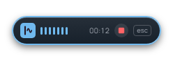

<div align="center">


# Sotto

**Press a shortcut. Speak. Your words appear — and never leave your computer.**

Sotto is a private, offline-first dictation app for Windows and Apple silicon Macs. Press the global shortcut, speak, press it again, and Sotto copies the local transcript and optionally pastes it at the active cursor. Raw audio stays in memory and is discarded after transcription.

[](https://github.com/millZach/Sotto/releases/latest)
[](https://github.com/millZach/Sotto/releases/latest)
[](#privacy-and-cost)
[](LICENSE.md)



**[⬇ Download the latest installer or disk image](https://github.com/millZach/Sotto/releases/latest)**

</div>

---

## Why Sotto

- 🔒 **Private by design** — the Whisper model and inference runtime run entirely on your machine. No cloud transcription, no analytics, no account, no telemetry. Audio is never written to disk.
- ⚡ **One shortcut, anywhere** — a global hotkey works in any app. Sotto always copies the transcript to the clipboard and can paste it at your cursor automatically.
- 🧠 **Three model presets** — the Balanced model ships in the installer; Fast and Accurate presets are optional, consent-gated downloads.
- 🖥️ **GPU-accelerated when possible** — WebGPU inference with an automatic CPU/WASM fallback.
- ✨ **Optional AI polish** — off by default: bring your own OpenRouter key for punctuation and self-correction cleanup of the finished text (never the audio), with a silent fallback to the raw local transcript.
- 💸 **Free** — no subscription, no per-use fee.

Sotto was formerly named TalkType; version 3.0.0 renamed the app and its visual identity. On first launch, Sotto automatically migrates settings, history, and downloaded models from an existing TalkType installation.

## Requirements

### Windows

- Windows 10 or Windows 11, x64
- A working microphone and permission for desktop apps to use it
- At least 1.5 GB of free space during installation for the installer, temporary extraction, the app, bundled Balanced speech model, and safe working headroom; the installed app is about 500 MB before optional models

### macOS

- macOS 11 (Big Sur) or newer — TODO(mac-bringup): replace with the LSMinimumSystemVersion read from the built bundle
- Apple silicon (arm64) only — Intel Macs are not supported
- At least 1.5 GB of free space while the disk image is mounted and copied into Applications; the installed app is about 500 MB before optional models
- A working microphone and microphone permission for Sotto in System Settings → Privacy & Security → Microphone
- Automation and Accessibility permission for Sotto if you want automatic paste; without them Sotto still copies every transcript to the clipboard

Node.js 22 or newer is needed on either platform only when developing from source; installed users do not need Node.js, Python, an account, an API key, or a separate model download.

## Privacy and cost

The included Balanced Whisper model and inference runtime run on this computer. Sotto has no cloud transcription, analytics, crash upload, update telemetry, account, subscription, or per-use fee. Audio is never persisted. Transcript history is local, optional, bounded, searchable, and clearable.

Optional Fast and Accurate models are not downloaded until you review their source, approximate size, license, and network-metadata disclosure and explicitly consent. Those downloads contact Hugging Face, so that provider receives ordinary request metadata such as IP address and request time; audio and transcripts are not sent.

Optional AI formatting is the one feature that sends transcript text off this computer, and it is off by default. When you enable it and supply your own OpenRouter API key, the finished transcript (never audio) is sent to OpenRouter for punctuation and self-correction cleanup. If the network is slow or offline, Sotto silently falls back to the raw local transcript.

## Install and first run

### Windows

Run the `Sotto Setup <version>.exe` installer and choose the per-user installation folder. The desktop shortcut is optional and unchecked by default; the installer always creates a Start Menu shortcut. Uninstalling removes either shortcut but preserves settings, history, and optional downloaded models by default so an accidental uninstall does not silently destroy local data.

Upgrading from TalkType: because the application identity changed in 3.0.0, Sotto installs alongside TalkType instead of replacing it. Your data migrates automatically the first time Sotto starts; uninstall TalkType afterward from Windows Settings → Apps.

Locally built artifacts are not code-signed because no Windows signing certificate is stored in this repository. Windows may therefore show an **Unknown publisher** or SmartScreen prompt. A public release should be Authenticode-signed by its distributor without changing application behavior.

### macOS

1. **Copy the app to Applications.** Open `Sotto-<version>-arm64.dmg` and drag **Sotto** onto the **Applications** shortcut in the same window, then eject the disk image and launch Sotto from Applications. Do not run Sotto from the mounted image: macOS App Translocation launches downloaded apps from a randomized read-only path, which changes the app location on every launch and makes permission grants and settings unreliable.

2. **Allow the unsigned build to open.** Sotto is ad-hoc signed but has no Apple Developer signature, so the first launch is refused with a message such as *"Sotto" is damaged and can't be opened* or *macOS cannot verify that this app is free from malware*. Open **System Settings → Privacy & Security**, scroll to the Security section, and click **Open Anyway** next to the message about Sotto, then confirm and launch Sotto again. Use this path first: macOS 15 and newer no longer offer the old Control-click → Open bypass for this case. As an alternative, clear the quarantine flag in Terminal and launch normally:

   ```bash
   xattr -dr com.apple.quarantine /Applications/Sotto.app
   ```

3. **Grant the permissions Sotto asks for.** The first dictation asks for microphone access. The first automatic paste asks for Automation ("Sotto wants to control System Events") and needs Sotto enabled in **System Settings → Privacy & Security → Accessibility** as well. Denying or missing either grant never loses a transcript: Sotto shows **Copied — paste manually** and leaves the complete text in the clipboard, and automatic paste starts working as soon as both grants are in place.

4. **Expect the permission prompts again after every update.** macOS keys these grants to the app's code signature, and an ad-hoc signed build gets a fresh identity on every rebuild. After installing a new version, macOS treats Sotto as a new app and asks for microphone, Automation, and Accessibility again; a stale entry may need to be removed from the list before the new one takes effect. This stops once Sotto ships Developer ID-signed builds.

### First run

First-run setup explains privacy, tests microphone access, verifies the included Balanced model, and shows the active shortcut and safe paste-test field. The default global shortcut is `Ctrl+Shift+Space` on Windows and `⌃⇧Space` (the literal Control key) on macOS. Press it once to start and again to stop and transcribe. `Escape` cancels an active session.

Sotto closes to the Windows notification area or the macOS menu bar. Use that menu to show the window, start or stop dictation, toggle automatic paste, or quit completely. On macOS the Dock icon appears only while the Sotto window is open; the menu-bar icon is always there.

## Settings

- Appearance: System, Light, or Dark theme; system or reduced motion
- Capture: microphone, global shortcut, recording limit, and local sound cues
- Transcription: Fast, Balanced, or Accurate preset; language; WebGPU or CPU/WASM preference; conservative whitespace formatting
- Formatting: optional AI cleanup via OpenRouter (off by default, needs your API key) with quality tiers, a personal dictionary for tricky words, and streaming transcription so long dictations finish almost immediately after you stop
- Output: mandatory clipboard safety copy, optional automatic paste, paste delay, and success-message duration
- Application and privacy: launch at login, start minimized, local history, retention, clear history, and reset settings

Automatic paste is best effort. Windows blocks synthetic input into elevated applications, password fields, protected desktops, and some custom editors. macOS blocks it in secure input fields and until both the Automation and Accessibility grants exist. When paste is rejected, Sotto shows **Copied — paste manually** and leaves the complete text in the clipboard. If a Windows target app is running as administrator, either paste manually or run both apps at the same integrity level.

## Development

```powershell
npm ci
npm run model:verify
npm run dev
```

The pinned Balanced model and ONNX runtime are already represented by hash-locked manifests. If a clean source checkout does not contain their large files, prepare them once with network access:

```powershell
npm run model:prepare
npm run model:verify
```

Normal transcription is local-only; model preparation is a release-engineering step, not an end-user first-run download.

The same commands run in Terminal on macOS.

## Test matrix

```powershell
npm run lint
npm run typecheck
npm test
npm run test:e2e
npm run model:verify
```

Unit and integration tests cover settings recovery, history privacy, audio math and lifecycle, model/runtime integrity, IPC validation, hotkeys, clipboard-before-paste output, startup, tray, window security, transcription orchestration, and widget synchronization. Electron end-to-end tests use an admitted non-packaged boundary with deterministic in-memory microphone, shortcut, clipboard, paste, startup, tray, and model adapters. They cover onboarding, registered-hotkey dictation, in-app paste, history on/off, theme and settings reload, hotkey conflict, microphone denial recovery, silence, paste fallback, hide-to-tray, single-instance behavior, and transcription failure. Widget visual tests verify ten 420x92 light/dark state images and transparent corners.

The deterministic boundary is rejected in packaged builds and accepts calls only from the trusted main renderer. It never logs transcript text or PCM.

## Build Windows artifacts

```powershell
npm run package:dir
npm run package:win
```

Artifacts are written to:

- `release/win-unpacked/Sotto.exe` — unpacked x64 application
- `release/Sotto Setup <version>.exe` — assisted, per-user x64 NSIS installer

Brand assets (`build/icon.png`, `build/icon.ico`, `build/installer-sidebar.bmp`) are generated from the SVG masters in `build/` with `node scripts/generate-brand-assets.mjs`.

The packaged `resources` directory contains `models/`, `runtime/`, `README.md`, and `THIRD_PARTY_NOTICES.md`. Each packaging command automatically verifies the source model before packaging and verifies the packaged model, runtime, notices, bridge, worker, and worklet afterward.

## Build macOS artifacts

```bash
npm run package:dir:mac
npm run package:mac
```

Artifacts are written to:

- `release/mac-arm64/Sotto.app` — unpacked arm64 application bundle
- `release/Sotto-<version>-arm64.dmg` — arm64 disk image with an Applications shortcut

Both commands verify the source model before packaging and the packaged model, runtime, notices, bridge, worker, and worklet afterward, exactly like the Windows commands. A fresh clone must run `npm run model:prepare` once with network access first, because the large model and runtime files are not stored in the repository.

The macOS icon is derived automatically from `build/icon.png` at packaging time; no `.icns` file is committed. The menu-bar template images (`resources/tray/sottoTemplate.png` and its `@2x` companion) come from the same `node scripts/generate-brand-assets.mjs` run as the Windows brand assets.

Builds are ad-hoc signed and not notarized, so anyone installing the disk image needs the macOS install steps above. Widget design captures (`npm run design:capture`) stay Windows-only; the committed reference images are captured on Windows.

## Troubleshooting

### Either platform

- **Shortcut conflict:** Choose another accelerator in Settings. Sotto keeps the last working shortcut if registration fails.
- **No speech detected:** Move closer to the microphone and confirm the level meter responds. Silence does not replace the clipboard or create history.
- **Model unavailable:** Use the included Balanced preset, run the model verification again in a source build, or remove and reinstall only the affected optional preset.
- **WebGPU failed:** Choose Auto or CPU/WASM. Sotto falls back locally without uploading audio.
- **AI formatting not applied:** Check that AI formatting is enabled with a valid OpenRouter API key and that the computer is online. When formatting fails or times out, Sotto delivers the raw local transcript instead of failing the dictation.
- **Window disappeared:** Sotto is probably hidden in the Windows notification area or the macOS menu bar. Open it from that icon or start Sotto again; the existing instance will be shown.

### Windows

- **Microphone denied:** Open Windows Settings → Privacy & security → Microphone, enable microphone access and desktop-app access, then retry.
- **No microphone found:** Connect or enable an input in Windows Settings → System → Sound, then select it in Sotto Settings.
- **Paste did not occur:** Paste manually with `Ctrl+V`; the transcript is already in the clipboard. Elevated and protected targets commonly reject automation.

### macOS

- **"Sotto is damaged and can't be opened":** This is Gatekeeper refusing an unsigned download, not a corrupted file. Use **System Settings → Privacy & Security → Open Anyway**, or run `xattr -dr com.apple.quarantine /Applications/Sotto.app`, then launch Sotto again.
- **Microphone denied:** Open System Settings → Privacy & Security → Microphone, allow Sotto, then retry.
- **Paste does nothing:** Sotto needs both System Settings → Privacy & Security → **Automation** (Sotto allowed to control System Events) and → **Accessibility**. Enable both, then dictate again; meanwhile the transcript is already in the clipboard, so `⌘V` works.
- **A permission prompt never reappears:** macOS remembers the denial. Reset the grants in Terminal and relaunch Sotto:

  ```bash
  tccutil reset Microphone com.sotto.desktop
  tccutil reset AppleEvents com.sotto.desktop
  tccutil reset Accessibility com.sotto.desktop
  ```

- **Sotto quits immediately after launching:** Check that the Mac has Apple silicon (Apple menu → About This Mac). Intel Macs are not supported and the arm64 build cannot run on them.

## License

Sotto is free to use under the freeware terms in [`LICENSE.md`](LICENSE.md): install and use it at no charge, share it only via unmodified official installers or a link to the official releases, no distribution of modified versions. The source is public for inspection but is not open-source licensed.

Third-party licenses and brand-generation provenance are recorded in `THIRD_PARTY_NOTICES.md`.
