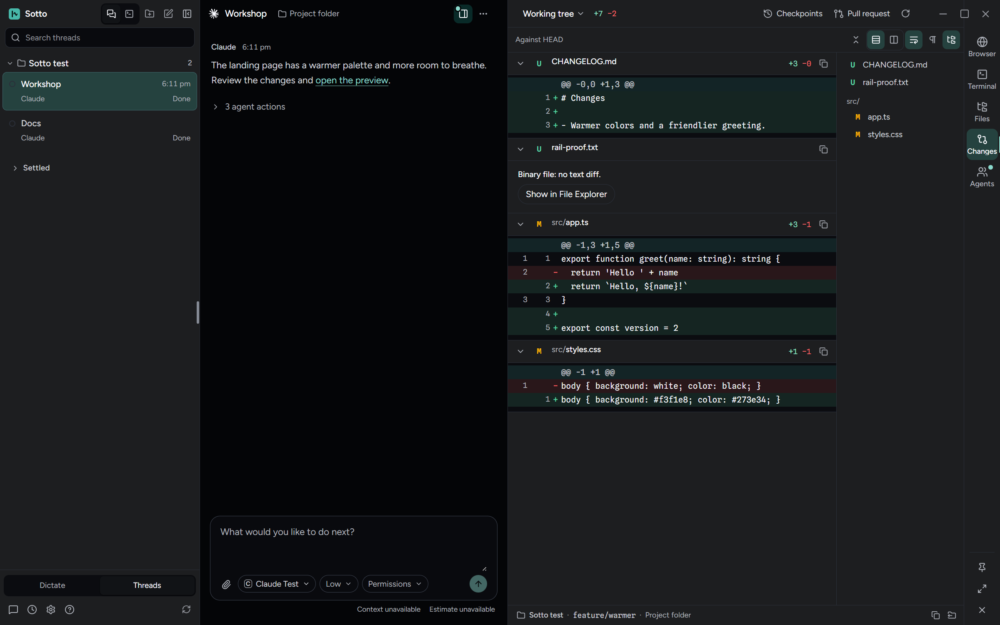

<div align="center">


# Sotto

**Your coding agents in one desktop window, with dictation built in.**

[](https://github.com/millZach/Sotto-releases/releases/latest)
[](#install)
[](LICENSE.md)

**[Download the latest release](https://github.com/millZach/Sotto-releases/releases/latest)**



</div>

Sotto runs the Claude Code, Codex, Grok Build and Devin clients you already have, and keeps every thread in one sidebar. It is free, open source and in beta.

## What it does

- **One sidebar for every agent.** Each provider keeps its own sign-in and models. Sotto keeps the threads.
- **You answer every request.** Anything a thread's permissions don't already allow waits for you.
- **Tools beside each thread.** A browser, a terminal, the thread's files and its changes.
- **Git in one press.** Commit, push and open a pull request. Leave the message empty and the agent writes it.
- **Worktrees for parallel work.** Give a thread its own branch and folder, and remove the folder when you're done.
- **Dictation anywhere.** Press `Ctrl+Shift+Space` (`⌃⇧Space` on a Mac), speak, and press it again. The text is copied and can be pasted at your cursor.

## Install

You need Windows 10 or 11 (x64), or an Apple silicon Mac with macOS 12 or newer.

**Windows.** Run `Sotto Setup <version>.exe`. At least 1 GB of free space during installation is needed. The desktop shortcut is optional and unchecked by default. The installer isn't code-signed, so Windows may show a SmartScreen warning.

**macOS.** Drag Sotto into Applications. The app isn't notarized, so the first launch is blocked: open **System Settings → Privacy & Security** and press **Open Anyway**, or run:

```bash
xattr -dr com.apple.quarantine /Applications/Sotto.app
```

Then install and sign in to at least one agent client, and connect it in **Settings → Providers**. For dictation, add an [OpenRouter API key](https://openrouter.ai/keys) in Settings.

## Privacy and cost

Sotto has no account of its own and collects nothing about you: no analytics, no crash reports. Your data leaves your computer only when a feature you use needs it, and only to that feature's service:

- **Dictation** goes to OpenRouter (`openrouter.ai`) on your key, where Microsoft MAI-Transcribe-2 transcribes it. Audio is never saved to disk. OpenRouter charges about $0.10 per hour of audio.
- **Optional AI cleanup** sends the finished text to OpenRouter too. It is off until you turn it on.
- **Your threads** go to the agent's own provider, under that provider's account and data policy.
- **Git** talks to your own remotes, including a background fetch every 30 seconds while the window is in front (you can change or turn it off in Settings → Git), and to GitHub through `gh` on your own sign-in for pull requests.
- **Update checks** ask GitHub for new Sotto versions (Windows) and `registry.npmjs.org` for new agent client versions. Both can be turned off.
- **Only if you use them:** `api.openai.com` and `api.x.ai` for optional reasoning and reply voices, `open-vsx.org` (with `openvsxorg.blob.core.windows.net` and `openvsx.eclipsecontent.org`) for themes, `huggingface.co` for the natural voice download, SSH hosts you add, and pages you open in Sotto's browser.

Dictation history stays on your computer, and you can turn it off. Keys are kept in your operating system's credential store.

## Build from source

With Node.js 24:

```sh
npm ci
npm run runtime:verify
npm run dev
```

`npm run package:win` and `npm run package:mac` build the installers. Each packaging command automatically verifies the source runtime before packaging.

## More

- [Guide](docs/guide.md): every feature, settings, remote hosts and troubleshooting
- [Agent control](docs/agent-control.md): providers and threads in depth
- [Contributing](AGENTS.md)

## License

[MIT](LICENSE.md). Third-party licenses are in [THIRD_PARTY_NOTICES.md](THIRD_PARTY_NOTICES.md).
