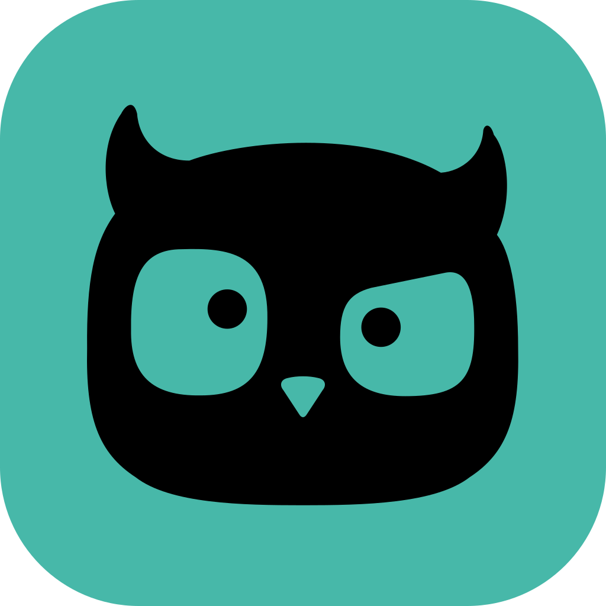
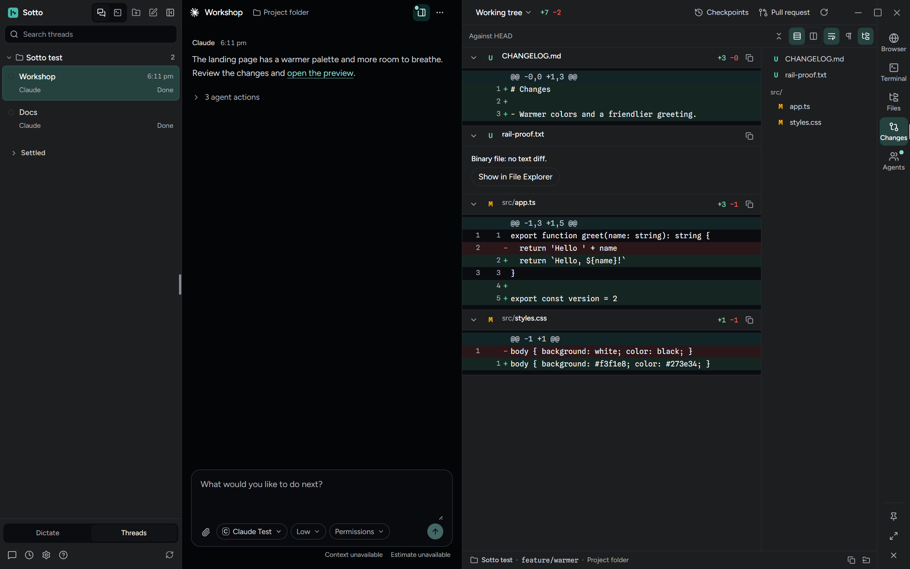

<div align="center">



# Sotto

**Your coding agents in one desktop window, with dictation built in.**

[](https://github.com/millZach/Sotto-releases/releases/latest)
[](#install)
[](LICENSE.md)

**[Download the latest release](https://github.com/millZach/Sotto-releases/releases/latest)**



</div>

Sotto runs the Claude Code, Codex, Grok Build and Devin clients you already have, and keeps every thread in one sidebar. It is free, open source and in beta.

Saved Codex conversations keep both sides after a restart. Opening a thread also repairs repeated prompts saved by earlier versions.

With the voice coordinator switched off, opening a remote thread does not start or check voice. Dictation still works.

When a failed creation keeps your prompt or screenshots, the error names the project where you can recover them. The prompt returns in the next new thread opened in that project, while this window stays open. Staged screenshots come with it while available; unused screenshots are kept for an hour. Prompts that cannot fit together stay as **Not sent** messages with **Restore prompt**.

## What it does

- **One sidebar for every agent.** Each provider keeps its own sign-in and models. Sotto keeps the threads. Stop still reaches running work when its last prompt is unconfirmed.
- **Visuals in the thread.** An agent in a project thread can draw a diagram, or a small interactive page it wrote, where you read its replies, to show how something works. A visual with steps walks you through it one step at a time, lighting the part each step is about; **Read all** shows every step at once. Drawing one asks you nothing; turn it off in Settings.
- **You answer every request.** Anything a thread's permissions don't already allow waits for you. A desktop set up over your SSH account can answer requests and change thread permissions as soon as setup finishes, and can do so over your tailnet as well once it connects that way. A phone or another device paired by code needs your separate permission to do those things.

If Codex asks for an approval Sotto cannot show, Sotto refuses it and tells you. This includes an unknown child thread on a thread's own Codex process. Nothing is approved; answer in Codex meanwhile.
- **Tools beside each thread.** A browser, a test iPhone, a terminal, the thread's files and its changes. The test iPhone is a phone-sized page in that browser where an agent checks a web or Expo-web build by tapping, swiping and typing, while you watch it float over the thread. It is not iOS. For a native build, add a run.cloud key and an agent can ask to start a **cloud iPhone**, an iOS simulator you watch the same way. Terminal input stays in order; if input is refused, Sotto says so before you try again.
- **A terminal under each thread.** Each thread pane opens its own terminal in the thread's working copy, across the bottom of the pane, with its button or Ctrl+J (Cmd+J on a Mac). Its shells keep running while it is hidden.
- **Codex's Computer Use.** In a Codex thread set to Full access, with the Codex app open, Codex can operate the apps on your computer. When the app changes its connection, Sotto refreshes the thread's tools before the next prompt; a refresh failure leaves that prompt unsent so you can try again. If its connection is still unavailable, open Codex if it is closed. Keep it open and try again. If that continues, restart Sotto when your other threads are idle.
- **Git in one press.** Commit, push and open a pull request. Leave the message empty and the agent writes it. Selected files keep staged hunks; files left out keep their staging. While a Git action runs, sends from threads sharing that checkout are refused. Your text is kept so you can send it again when the action finishes. A refused Git action names the thread holding the folder and says whether to wait, answer it or review its pending work.
- **Worktrees for parallel work.** Choose the current checkout, a new worktree, or one of five recent worktrees under the composer. Search finds older worktrees. Remove a thread's own folder when you're done, after reviewing any ignored files and their file counts. Nested repositories and worktrees are listed too, including uncommitted work and repository commits not on any remote, including history in clean or deinitialized submodules. They are removed only after your acknowledgement.
- **Dictation anywhere.** Press `Ctrl+Shift+Space` (`⌃⇧Space` on a Mac), speak, and press it again. The text is copied and can be pasted at your cursor.

Thread drafts save automatically while you type, including while other threads are working.
For a remote managed thread, the laptop also keeps the latest text and image selections during remote saves. A disconnect or busy host does not replace those edits with an older host draft. Recovery saves the original draft; it never sends an answer automatically.

Standalone Chats, including Talk and Generate prompt, has been removed. With **Keep local history** on, existing `personal-chat/` files and personal records in `request-drafts.json` are preserved without reopening conversations, reconnecting providers or showing old drafts. Turning history off clears Sotto's retained personal transcripts and submitted answers; startup applies the same cleanup when history is already off. Provider-owned history is untouched; nothing is migrated into Threads.

After you type in the Claude CLI, the next send from Sotto resumes the updated native history, even if the restart stops background work.

If a Claude Code answer is unconfirmed, **Check again** checks the request without sending anything. A delayed write keeps your original choice; another answer is allowed only after the write fails outright or the client is gone.
Pressing the dictation shortcut again while the microphone is connecting cancels the session as soon as it is ready. No audio is kept or transcribed.

Settings → Application sets the working-copy default for new threads. Expand **Project defaults** to choose a different default for one project. Previously saved project choices are kept when Sotto updates.

Saved question answers clear when the computer running the thread confirms receiving them. If **Check again** confirms acceptance, the answer stays sent; it does not become an editable draft again. An unconfirmed answer stays available for recovery and is never sent again automatically. Remote confirmation requires an updated desktop and host. The composer sends its draft in one action. If the host needs an update to save or send that draft, its text stays only in the current window. Update the host before closing the window.

If a provider asks the same question again after restarting, its earlier receipt does not answer the new request. **Check again** reads the provider before allowing a fresh answer. It sends nothing; you choose and send again yourself. An older remote host may need an update to support this check.

New threads open in Unsettled with the defaults saved in Settings → Agents. An existing empty thread is reused only while it is unsettled, its known model, effort and permission choices match those defaults, and no setting change is pending.

In Settings, **Test microphone** checks the same input selected for dictation. **Stop test**, hiding the window, or leaving Dictation closes the microphone. Changing the input clears the previous test. A quiet test asks you to check that the microphone is not muted.

The personal dictionary holds up to 4,000 characters. It saves when you leave the field or Settings. A paste cut to fit the limit is announced, and a failed save after leaving Settings says where to enter the unsaved edits again.

A failed save under Phones or for **Run the local host** shows beside the control and keeps the previous setting.

Escape dismisses a saved host's SSH question. While SSH is still waiting, **Answer** on its row in Settings → Hosts reopens it.

Terminal mode keeps closed terminals on its Closed shelf until you quit. Reopen starts the same command with fresh output; Stop keeps the output readable.

## Install

You need Windows 10 or 11 (x64), or an Apple silicon Mac with macOS 12 or newer.

**Windows.** Run `Sotto Setup <version>.exe`. Connecting an SSH host uses Windows' .NET Framework 4, which Windows 10 and 11 include. At least 1 GB of free space during installation is needed. The desktop shortcut is optional and unchecked by default. The installer isn't code-signed, so Windows may show a SmartScreen warning.

**macOS.** Drag Sotto into Applications. The app isn't notarized, so the first launch is blocked: open **System Settings → Privacy & Security** and press **Open Anyway**, or run:

```bash
xattr -dr com.apple.quarantine /Applications/Sotto.app
```

First-run setup asks you to choose a microphone from the inputs the computer can see, test it, or choose **Skip for now** before continuing. Then install and sign in to at least one agent client, and connect it in **Settings → Providers**. **Connect providers** uses the clients installed on this computer, leaves one you turned off as it is, and chooses Claude Code when Codex is not. For dictation, add an [OpenRouter API key](https://openrouter.ai/keys) in Settings.

## Privacy and cost

Sotto has no account of its own and collects nothing about you: no analytics, no crash reports.

**Reset settings** restores defaults and reopens setup. It keeps your saved OpenRouter key, including when the reset fails.

If a key saved by an older version of Sotto cannot be moved into the credential store, Sotto removes the plaintext key from settings anyway. Settings says it could not be stored securely and asks you to enter it again.

Your data leaves your computer only when a feature you use needs it, and only to that feature's service:

- **Dictation** goes to OpenRouter (`openrouter.ai`) on your key, where Microsoft MAI-Transcribe-2 transcribes it. Audio is never saved to disk. When transcription fails, the recording stays in memory until you try again or discard it. OpenRouter charges about $0.10 per hour of audio.
- **Optional AI cleanup** sends the finished text to OpenRouter too. It is off until you turn it on.
- **Your threads** go to the agent's own provider, under that provider's account and data policy. A Sotto host on another machine starts every client signed in there when the host starts, and each talks to its own provider under the account signed in on that machine.
- **Screenshots** you attach to a thread, or add from Sotto's browser as feedback, are scaled down, in the same format, to 2576 pixels on their longer side before they go anywhere, because that is the most any model Sotto sends them to reads: Claude 4.7 and later read up to 2576 and Codex up to 2048. The pixels past it would cost transfer and storage and change nothing the model reads. Smaller images, animated ones, GIFs, and any the smaller copy would not make smaller in bytes, go as you attached them; nothing is scaled up. **Photos** from the iPhone app are scaled to the same bound on the phone and drawn again without their location or camera details before they go, to the computer that runs the thread only.
- **Sotto's browser** is used by agents without asking, by default: they can open pages, click and type there, and see every page in that thread's browser, including pages you open and sites you are signed in to in it. The same goes for its test iPhone, where a tap counts as a click. Turn that off in Settings → Application, or stop it for one thread in Tools → Browser or Tools → iPhone. The test iPhone runs on this computer and contacts nothing but the pages you or an agent open on it.
- **The cloud iPhone**, only once you add a run.cloud key in Settings → Cloud iPhone, sends the simulator build an agent names to the upload address run.cloud's own API gives for it (`api.run.cloud` and run.cloud's own viewer page), in the EU, when you press **Start cloud iPhone** in the thread. Each session asks first; nothing is uploaded before you answer, and Sotto deletes the upload when the session ends. If a release or a deletion does not finish, Sotto keeps trying while Sotto is open rather than call it done. The session's screen streams back to the phone over the thread, from run.cloud's own viewer. run.cloud bills about $0.02 a minute on your key, after its first $15 each month; Sotto stops starting sessions at your monthly cap, 750 minutes unless you change it, and ends a session after 5 idle minutes. The key stays in your operating system's credential store and is never logged.
- **Visuals** an agent draws in a thread are made on this computer from what the agent sent, and contact no one. An interactive one, a page the agent wrote, runs locked down: Sotto cancels every request it makes and sends its traffic to a proxy that answers nothing. The three known gaps are closed ([#819](https://github.com/millZach/Sotto/issues/819)): address (DNS) prefetching is off for the app, WebRTC is removed from the page and its frames, and copy and cut commands the page starts write nothing. You can still copy selected text yourself. [ADR-0060](docs/adr/0060-an-interactive-visual-runs-in-a-sealed-page.md) says what its tests prove and what they leave untested.
- **Git** talks to your own remotes, including a background fetch every 30 seconds while the window is in front (you can change or turn it off in Settings → Git), and to GitHub through `gh` on your own sign-in for pull requests.
- **Phone access**, once you turn it on in Settings → Phones, sends your threads, and the replies you send from a phone, to the phones you pair (iPhone, or Android with the proposed client in `apps/android`), over your own tailnet. Sotto runs the `tailscale` command on this computer to set up Tailscale Serve on port 8443, or 10000 when another app already uses 8443; that command talks to the Tailscale app already running here, so no new service is contacted. If your tailnet has not turned Serve on, Settings → Phones offers to open the `login.tailscale.com` page Tailscale gives for it, in your browser, only when you press it. Only phones you pair can connect. A paired phone, like a paired computer, can also ask for what Tools shows of a thread: the files in its working folder and their contents, its Git changes, and its agents. Pairing also lets a phone choose the coordinator’s reasoning provider and model, using the computer’s saved credentials; this can change which reasoning host receives assignment text and relevant thread context. A phone answers questions and permissions only after you turn on Can answer for it. Turning it off, or quitting Sotto, asks Tailscale to remove the Serve setting. If that fails, Phones cannot connect while Sotto finishes cleanup and retries while it is open. A host you added in Settings → Hosts can do the same for its own threads, once you turn it on with **Phones…** on its row: the host runs `tailscale` on its own machine, and your threads there go to your paired phones over your tailnet. No new service is contacted for it. The host's Tailscale Serve setting can also carry this computer's own connection to it over your tailnet, so Sotto reaches it without signing in over SSH each time. Adding a host whose Tailscale is running turns that setting on by default. Add host says so before you press it, and the press is your consent. So are choosing the tailnet in **Edit connection**, which says so too, and **Try the tailnet again** on Add host's last step. This computer's pairing then works from anywhere on your tailnet, with the permission to answer that your SSH account gave it.
- **Tailscale on this computer.** Settings → Hosts and Add host run the `tailscale` command here to see whether Tailscale is connected and which devices are on your tailnet. That command talks to the Tailscale app already running here, so no new service is contacted, and what it lists stays on this computer. **Connect to Tailscale** runs `tailscale up`; if Tailscale asks you to sign in, its `login.tailscale.com` page opens in your browser, because you pressed the button. **Get Tailscale** opens `tailscale.com/download`.
- **Signing in a host's provider from this computer**, with **Sign in** on its tile in Settings → Hosts, runs that provider's own sign-in on the host, and you finish it in this computer's browser. Sotto opens the provider's own page only when you press **Open sign-in page**, and only `auth.openai.com` for Codex, `accounts.x.ai` for Grok Build, and `claude.com` or `claude.ai` for Claude Code. The page's address, the code it asks for and the code you paste back pass between this computer and the host only while you sign in; they are never logged or written down by Sotto, and the host drops them when the sign-in ends or after 15 minutes. The provider's own client keeps its sign-in on the host, as it would from a terminal there. Claude Code signs in to your Claude subscription only; Sotto never switches a host to API billing.
- **Setting up a host with an agent**, when you press Start setup in Add host, runs a thread on the model you pick. Its provider receives the setup's brief (the machine's name, its SSH address and the folders the host uses, never a key) and the output of every command the agent runs on that machine over SSH, such as file listings, versions and error messages, the way any thread's provider receives what its commands print. You answer each command that changes something first; the provider may still run read-only commands on this computer, such as listing or reading files, without asking. The machine may download the Sotto host from the releases page on GitHub. When it cannot, the agent may download it on this computer, after you approve the command, and copy it to the machine over SSH.
- **Installing, updating or fixing a host's provider with an agent**, when you press Start install (update, fix) on its tile in Settings → Hosts, runs a thread on the model you pick, the same way. Its provider receives that job's brief (the host's name and SSH address, which provider, what the host reported about it, where the host looks for it and how its maker installs it, never a key or a sign-in code) and the output of every command the agent runs on the host. The host may download the provider from its maker, such as `claude.ai`, npm, `chatgpt.com`, `x.ai` or `cli.devin.ai`, as its own install would. The agent never signs the provider in; you do, from its tile.
- **Updating a host**, when you press **Update** in the pill on the Threads page, has the host download this computer's version of the Sotto host, and its checksum, from the releases page on GitHub (`github.com`, which serves the files from `release-assets.githubusercontent.com`). When the host cannot reach GitHub, this computer downloads the same files from the same places and copies them to the host over SSH. Nothing about you, the host or its threads is sent.
- **Update checks** ask GitHub for new Sotto versions (Windows) and `registry.npmjs.org` for new agent client versions, on this computer and on each host. Both can be turned off.
- **Updating a host's clients**, when you press **Update** or **Update all** on a host's tiles in Settings → Hosts, runs the client's own installer on that host. For a client mise installed that is `mise upgrade`, which reaches whatever mise is set up to use for that tool: its version lookups and the tool's own downloads, such as GitHub releases or `registry.npmjs.org`. Nothing about you or your threads is sent. Installer details hide absolute file paths and keep the error text.
- **Only if you use them:** `api.openai.com` and `api.x.ai` for optional reasoning and reply voices, `open-vsx.org` (with `openvsxorg.blob.core.windows.net` and `openvsx.eclipsecontent.org`) for themes, `huggingface.co` for the natural voice download, SSH hosts you add, and those hosts' own tailnet addresses, and pages you open in Sotto's browser. When an SSH host you add uses Tailscale SSH and Tailscale asks you to approve the connection, Add host offers to open the `login.tailscale.com` page Tailscale gives for it, in your browser, only when you press it.

Thread history keeps long replies in full. An event that cannot be saved raises a notice on its thread while other valid events continue to save. Storage failures retry. Dictation history stays on your computer, and you can turn it off. Older dictation transcripts can still be deleted while history is off. If completed dictation cannot reach the clipboard, Dictate keeps selectable text with **Copy text** until you dismiss it or close Sotto. With history off, that recovery stays in memory. Screenshots you attach to a thread, and photos from the iPhone app, are kept as files on the computer that runs the thread, only while an unsent draft, a queued message or a recent message's preview needs them and for an hour after; with history off, new ones stay in memory and are not written to disk. Keys are kept in your operating system's credential store. If Sotto cannot read its saved keys, it preserves the encrypted file and shows a notice. Add your keys again in Settings. Turn checkpoints follow Keep local history. Turning it off or forgetting a thread deletes its saved checkpoints at once, along with file backups that no other checkpoint needs. Turning history off, forgetting a thread and the age and size limits keep unfinished revert records and their file backups until recovery finishes. Completed checkpoints expire after 30 days; checkpoint storage is capped at 500 MB, removing the oldest checkpoints and recovery backups first. Turning history back on starts fresh checkpoints.

While **Keep local history** is on, the desktop keeps a startup copy of your threads so Threads can show them before providers reconnect. The copy is not encrypted. For each thread it holds your last message and the last reply, up to 2,000 characters each, and any request waiting for your answer, including the command a permission request would run. Turning history off deletes the copy and stops new ones.

The same setting controls the laptop's recovery copy of unsent remote managed drafts in `remote-drafts.json`. It contains text, image handles and the original question binding, not image bytes. With history off, that copy stays in memory and does not survive quitting. Turning history off clears its disk copies. If a remote image is no longer available, Sotto keeps the text and asks you to attach the image again before sending.

Recovery keeps a conflicting laptop edit for review instead of replacing newer host text. A Send whose result is unknown stays held until exact confirmation; reconnecting never sends it again. Unreadable local draft storage leaves remote connections available and preserves the original file while history is on. Forget still revokes and removes a host if optional draft cleanup fails; adding it again does not recover its forgotten drafts.

Diagnostic turn records keep event names, IDs, outcomes, fixed failure codes and timings only. They never keep prompt, answer or error text. On upgrade, Sotto removes text from existing turn records before starting the coordinator. If that rewrite cannot finish, Sotto deletes the diagnostic file; if deletion also fails, it asks you to close apps using the file and restart.

If thread messages cannot be saved, Sotto keeps them in memory and retries while it is open. The warning stays until they are saved. Restore storage access before quitting; unsaved messages cannot survive a restart.

The iPhone app opens on **Threads**: questions and permissions first, working threads next, then recent threads. The page scrolls as one with its search field, and a computer selector narrows the list. Confirmed background work and running compaction count as ongoing work, matching desktop. A thread that finished while you were looking elsewhere reads **Just finished** on both the iPhone and the desktop until you open it on either, and the Threads tab counts it with the waiting requests. Unsettled threads stay visible; **Settled** expands work put aside on desktop. A thread shows the agent's steps between its messages in the order they happened, each run of them folded into one line that shows what it is doing while it works and opens to list them. **Computers** manages pairings, and **Settings** keeps this iPhone's theme, appearance, text size, density, notifications and new-thread defaults. Notifications are local: they arrive only while Sotto is open on the iPhone, and nothing is sent anywhere to deliver them. The app is in development and talks only to your own Sotto host, through your private Tailscale address. It looks the host's name up through Tailscale's own name service on the phone, pairs with a code the host prints, and never answers a permission unless you have allowed it on the host. Changes to Can answer reach a connected iPhone without reconnecting; older hosts keep their reconnect behavior. A damaged saved-computers list is recovered from readable pairings; the app reports how many computers need pairing again, once for each unreadable saved item and warns when saved unconfirmed actions cannot be read. "Answer sent." requires that command's own completed receipt confirming its successful outcome; a vanished request alone says it is no longer waiting. An unconfirmed phone answer is reported to that phone without a desktop notice or spoken reply. A reply can carry photos from the library or the camera, scaled and stripped of location and camera details on the phone; they go to the computer that runs the thread, and only to a model that reads images. A reply reads **Sending…** while its computer is still working on it, and is marked unconfirmed only when the computer can't say.

**New thread** on iPhone lets you choose a connected computer, one of its projects or another folder on it, and that computer's model, effort and permissions, starting on your defaults from Settings where that computer offers them. The thread uses the shared project folder, or a new worktree when you choose one, and starts work when you send its first message. Permissions start by asking; a mode that allows actions without asking needs **Can answer** on that computer. Folder names and paths travel over the same private connection, and a creation the computer did not confirm is shown without being sent again.

Remote navigation belongs to each client. Compose, send and draft controls act on the thread that client picked, preserving drafts on other threads. Answers still require Can answer.

The iPhone checks each connection while Sotto is open. Pending reads keep slow thread downloads connected for up to two minutes. After a drop it retries with increasing waits and a small random variation, up to thirty seconds; a successful liveness check resets the wait. It refreshes threads and checks unconfirmed actions without sending them again. Returning from the background opens a fresh connection.

The iPhone distinguishes connection and read waits from unconfirmed sends, and says when to wait before trying again.

Older phones and desktop connections allow two missed keep-alive rounds. Sending frames and receiving partial frames keep slow transfers from counting as silence.

## Build from source

With Node.js 24:

```sh
npm ci
npm run runtime:verify
npm run dev
```

`npm run package:win` and `npm run package:mac` build the installers. Each packaging command automatically verifies the source runtime before packaging.

## More

- [Guide](docs/guide.md): every feature, settings, remote hosts and troubleshooting
- [Agent control](docs/agent-control.md): providers and threads in depth
- [iPhone app](apps/ios/README.md): building, pairing and installing the iPhone client (in development)
- [Contributing](AGENTS.md)

## License

[MIT](LICENSE.md). Third-party licenses are in [THIRD_PARTY_NOTICES.md](THIRD_PARTY_NOTICES.md).
