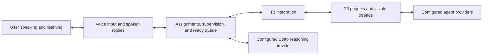

# Sotto agent control center

Status: design draft for review, September 9, 2026. No application changes or live integration tests have been made for this proposal.

## Product and first release

Sotto is a desktop voice control center for the agents people already use. It routes instructions to the right app and thread, handles routine follow-ups within the user's assignment, and brings decisions and finished work back to the user one thread at a time.

The initial audience is Zach and other builders. T3 Code is the first integration. Support across other harnesses and environments is the product direction; the first release connects to local T3. Remote connections follow later.

Free Sotto retains basic local dictation. Paid Sotto adds conversational voice control, app integrations, and supervision. Users bring their own supported provider subscriptions or API accounts. The initial paid offering includes no model-usage allowance. Set the price after validating the experience and measuring support and operating costs.

Wake-phrase activation and spoken replies are required in the first release. Telegram, Hermes, Grokbot, remote environments, and a public plugin SDK are deferred. The existing Sotto branding and dictation experience remain the starting point.

## Agreed interaction

1. Say "Hey Sotto" to begin interacting with Sotto.
2. Specify a project name and folder, or use a configured default projects directory. Sotto creates the project folder in that location and creates the real T3 project.
3. Ask for a thread using a named available provider or model. Sotto uses the configured default unless the user requests something different.
4. Dictate the prompt. Pauses do not submit it. Say "send it" to submit.
5. Sotto supervises threads assigned to it. Routine directional questions and corrections that clearly belong to the agent's assignment can receive automatic replies.
6. Questions requiring human judgment, and work ready for another prompt, enter a queue.
7. Sotto identifies the project and thread, gives a concise update or question, and waits for the user's response.
8. After the user sends a response, that agent can work while Sotto presents the next ready thread.

Threads remain visible in T3 and available for manual interaction. Sotto's compact, expandable widget shows the transcript, active project and thread, listening state, ready queue, and pending questions. T3 remains the full conversation workspace.

Spoken acknowledgments describe actions as they happen. Sotto reports success only after receiving confirmation from the integration. An unavailable model or provider produces an explanation and a choice; Sotto does not silently switch providers.

## Manual takeover must be explicit

This rule needs prominent interface copy, a visible state, and an acceptance check. It must not be buried in help text.

**When the user sends a message directly inside an assigned T3 thread, Sotto stops sending automatic replies to that thread. It continues monitoring. The user explicitly resumes management.**

Proposed widget copy:

> **Manual control · Workshop**
>
> You're replying directly in T3. Sotto is still watching this thread, but won't send replies. Say "resume managing Workshop" or select **Resume management** to hand it back.

Proposed spoken notice, once when control changes:

> "You're controlling Workshop. I'll keep watching. Say 'resume managing Workshop' when you want me to take over again."

Operational details for review:

- Reading, selecting, or scrolling through a thread does not transfer control. Sending a message directly in T3 does.
- Manual control pauses Sotto's automatic replies for that thread. It does not cancel an agent operation already running.
- Other assigned threads remain managed.
- The thread keeps its visible status and outstanding questions.
- A voice command or button explicitly resumes management. Simply leaving the T3 window does not resume it.
- User replies submitted through Sotto's own queue are part of the managed interaction and do not trigger manual takeover.
- Sotto must distinguish its own submissions from external user messages. If an integration cannot establish that distinction, automatic takeover detection is unavailable and the limitation must be visible.

## Supervision and the ready queue

Sotto acts within the user's assignment. If an agent reports an issue it should resolve, such as a failing check caused by its change, Sotto can ask it to correct the issue. If resolving the issue needs a human decision, Sotto queues the question.

The accepted boundary allows routine project edits, checks, and implementation decisions. Unclear requirements, scope changes, publishing, external messages, and additional spending require user involvement unless already authorized. Sotto must also respect the host application's permissions.

When the requested work is complete, Sotto brings the thread back for review or another prompt. It does not invent a new assignment to keep the agent busy. It must distinguish an agent's reported status from checks that the available evidence actually confirms.

The configurable starting limit is five automatic follow-ups per assignment. Pause earlier if the same failure repeats without progress. At the limit, stop sending new automatic replies and ask the user whether to continue. This limit does not by itself terminate work already running in T3.

Only one thread occupies the spoken interaction at a time. Other agents can continue working. Proposed queue defaults are arrival order, with no interruption of an in-progress user response. The user can change focus:

| Request | Behavior |
| --- | --- |
| "Send it" | Submit the composed response to the identified thread, then advance to the next ready thread. |
| "Later" | Defer the current item without answering its question or approving anything. |
| "Next" | Present the next ready item. An unresolved question remains available. |
| "Switch to Workshop" | Select the named thread. Ask if several threads match. |
| "Resume managing Workshop" | Return that thread to automatic management. |

A new ready event must not redirect an utterance already being composed for another thread. Thread, project, and environment identity travel with each queue item and submission.

## Architecture proposal

Sotto owns voice interaction, assignments, the ready queue, and decisions about whether to answer or ask the user. Each integration translates supported actions and events for its application. The host application retains its agent execution and configuration.

Build the first integrations behind a common interface. Publish an SDK after a second integration has tested the design. The interface should describe capabilities separately, including:

- Discover projects, threads, available providers, and models.
- Create or select a project and thread.
- Submit a prompt and observe the result.
- Receive status changes, clarification questions, and permission requests.
- Answer a specific pending question or permission request.
- Request interruption where supported.
- Identify external user submissions and reconnect to existing state.

An integration may expose fewer capabilities. The interface must show those limits and disable unsupported automation. Full supervision requires reliable status and response handling. Submitting a prompt alone is insufficient evidence that a task finished.

Keep the identity of each app, environment, project, and thread in the control layer from the start. The first release still connects only to local T3.

## Accounts, subscriptions, and credentials

There are separate connections to consider:

| Connection | Responsibility |
| --- | --- |
| Sotto membership | Enables the paid control-center features. |
| T3's configured providers | Fund and authenticate the agents doing project work. |
| Sotto reasoning and speech | Fund and authenticate conversational control, supervision, and spoken replies. A provider may cover more than one role. |

Prefer existing subscriptions wherever the exact integration route is available and supported. API keys remain an option. An API key identifies an account; the provider determines which allowance, credits, or invoice covers its use.

Each connection should show its role, provider, sign-in method, and known billing source. Do not silently change to a different account or paid API route when an allowance runs out.

Keep host-owned authentication with the host where the supported integration permits it. Credentials Sotto must hold should use OS-backed secure storage. The current application stores its optional formatting key through the ordinary settings repository; expanding credential support requires a dedicated storage design and migration.

Proposed membership implementation: a Sotto account and hosted checkout, server-validated billing events, and a cached entitlement for the desktop application. Keep membership metadata separate from agent prompts and credentials. Free dictation remains usable without a Sotto account. Choose the billing service, entitlement validity policy, and exact price during the commercial rollout stage.

Wake detection and dictation remain local in the proposed first implementation. Configured cloud services may handle reasoning and spoken replies after activation. Local wake listening does not require uploading background audio.

## Implementation sequence and acceptance gates

### 1. Prove the T3 connection and voice interaction

Before treating the internal T3 interfaces as a product dependency, test an authenticated connection against a known installed version. Create a real folder, project, and thread; submit a prompt; observe changes in T3's visible application; receive and answer a question; and distinguish a direct user message from a Sotto submission.

Also prove local wake detection, spoken replies, interruption of speech, and prompt capture that tolerates long pauses. Measure latency and false activations, including whether Sotto's own voice can trigger it. Select the speech and reasoning implementations from these results and verified connection terms.

Gate: the actual desktop journey works. Documentation inspection alone does not pass this gate.

### 2. Deliver the single-thread journey

Connect wake activation, project selection or creation, configured model selection, spoken acknowledgments, prompt composition, and "send it." Keep the active target visible and recover from connection errors without losing the user's prompt.

Gate: a user can complete the journey by voice and take over in the same T3 thread. Existing-folder conflicts produce an explicit choice without overwriting work. A missing provider is explained without a silent replacement.

### 3. Add assignment supervision and multiple-thread handling

Implement assigned-thread state, automatic follow-ups, pending human decisions, the follow-up limit, and the ready queue. Make manual control visible and resumable.

Gate: assign three threads, arrange overlapping completion and question events, and verify sequential spoken presentation and correct reply routing. Exercise later, next, named selection, a human-required decision, repeated failure, the follow-up limit, and direct manual takeover. Verify that one thread's control state does not affect the others.

Reconnection must reconcile existing work before issuing new commands. A lost acknowledgment must not cause a duplicate project, thread, or prompt submission. An uncertain action result is shown as uncertain until resolved.

### 4. Validate connections and introduce paid access

Ship the private beta with supported user-owned provider access. Document the tested account routes and any integration limitations. Measure voice usage, supervision usage, and support effort before choosing the Sotto subscription price.

Add account and billing flows after the core desktop experience passes its gates. Validate sign-in, purchase, renewal, cancellation, unavailable billing services, and return to the free feature set. Do not abruptly cancel work already running inside another application when a Sotto entitlement changes.

### 5. Release and extend

Inspect the real application experience, including first use, wake activation, spoken responses, queue presentation, errors, and manual control. The current application supports Windows and Apple silicon macOS; this proposal preserves that support. Begin the technical proof on the current Windows workspace and verify macOS before claiming release parity.

Then add a second harness integration to test the common interface. Remote environments, optional messaging escalation, and a public plugin SDK follow as separately scoped work.

## Verified findings and remaining uncertainty

T3 source inspection at commit `e16b8b059c9f5ff6dfed1addecffb831c6aee043` found shared desktop/web/mobile application state, project and thread creation commands, prompt submission, question and permission responses, and provider/model discovery. These are internal contracts, not a verified stable third-party API. No Sotto connection, visible-thread focusing, or takeover detection has been tested.

Sources:

- [T3 architecture](https://github.com/pingdotgg/t3code/blob/e16b8b059c9f5ff6dfed1addecffb831c6aee043/docs/internals/overview.md)
- [T3 orchestration contracts](https://github.com/pingdotgg/t3code/blob/e16b8b059c9f5ff6dfed1addecffb831c6aee043/packages/contracts/src/orchestration.ts)
- [T3 provider and model catalog](https://github.com/pingdotgg/t3code/blob/e16b8b059c9f5ff6dfed1addecffb831c6aee043/packages/contracts/src/server.ts)
- [T3 environment authentication](https://github.com/pingdotgg/t3code/blob/e16b8b059c9f5ff6dfed1addecffb831c6aee043/docs/internals/environment-auth.md)

Provider support is route-specific. Codex documents ChatGPT sign-in for app-server clients; the inspected Realtime voice documentation describes metered API usage. Claude documentation distinguishes native account access, third-party integration approval, and usage billing. xAI documents Voice API authentication and pricing, while eligibility of particular third-party subscription routes remains unverified. Recheck the selected routes before implementation or a commercial promise.

- [Codex app-server authentication](https://learn.chatgpt.com/docs/app-server#authentication-modes)
- [OpenAI Realtime billing](https://developers.openai.com/api/docs/guides/realtime-costs)
- [Claude SDK integration requirements](https://code.claude.com/docs/en/agent-sdk/overview)
- [Claude plan billing update](https://support.claude.com/en/articles/15036540-use-the-claude-agent-sdk-with-your-claude-plan)
- [xAI Voice API](https://docs.x.ai/developers/model-capabilities/audio/voice)
- [Grok subscription FAQ](https://docs.x.ai/grok/faq)

The remaining work is technical validation and review of this draft. Exact provider choices, numeric voice-quality targets, subscription price, and billing-service configuration are deliberately deferred to the validation and commercial stages above.
