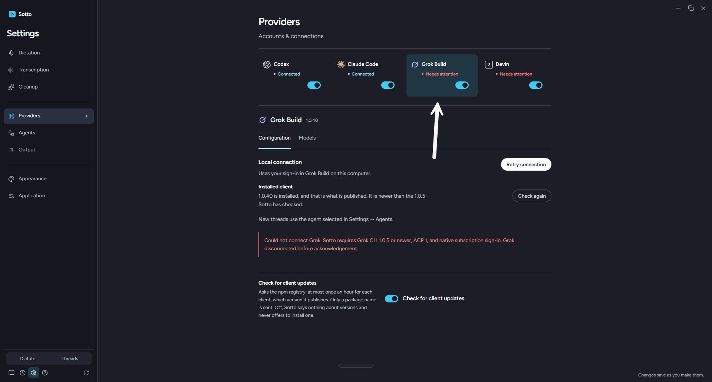

# Grok would not connect, and the error blamed the version

Windows 11, 2026-09-21, against the machine's own Grok Build 1.0.40 and the real user-data folder at
`%APPDATA%/sotto`. Nothing here was run against a throwaway profile, which is the point: the bug only
appears when there is a thread to read.

## What the app said

Settings showed Grok Build **1.0.40**, "Needs attention", and:

> Could not connect Grok. Sotto requires Grok CLI 1.0.5 or newer, ACP 1, and native subscription
> sign-in. Grok disconnected before acknowledgement.



Every clause of the first sentence was false. The screen said so itself: the version chip beside the
title is `state.version`, and `verifiedVersion` is what puts "It is newer than the 1.0.5 Sotto has
checked" under **Installed client**. Both are assigned inside the `initialize` response callback
(`grok.ts:263-264`), so the handshake had already succeeded before anything went wrong.

## What the client actually does

A probe that spawns `grok.exe` with the adapter's own arguments, environment and working directory, then
sends the adapter's own frames in order:

| Step | Result | Bytes on the wire |
| --- | --- | --- |
| `initialize` | ok, `agentVersion` 1.0.40, ACP 1, `cached_token` offered | 5,025 |
| `authenticate` (`cached_token`, headless) | ok, SuperGrok Heavy | 366 |
| `session/load` of the machine's one Grok thread | ok, 389 durable entries | 4,745 |
| `_x.ai/session/updates` offset 0, limit 100 | ok | **1,618,978** |
| `_x.ai/session/updates` offset 100, limit 100 | ok | **2,756,464** |
| `_x.ai/session/updates` offset 200, limit 100 | ok | **1,665,435** |
| `_x.ai/session/updates` offset 300, limit 100 | ok | 541,091 |

The client never misbehaved. It answered every request, and three of its four history pages were over a
megabyte, because a page is `HISTORY_PAGE_SIZE` entries on one line and an entry carries whatever that
session's tools printed.

## The cause

`GrokRpc` failed the transport when the unterminated stdout line passed 1 MB
(`grokRpc.ts`, the `MAX_FRAME_BYTES` check), and again when the queue of unprocessed lines passed 1 MB.
`connect()` reads history before it returns (`grok.ts:289`), so the first page of a real thread ended the
connection, the in-flight request rejected with "Grok disconnected before acknowledgement", and the catch
dressed it in the version requirement.

Grok was the only adapter with that cap. Codex allows 128 MB a frame and twice that queued
(`codex.ts:33-34`); Claude sizes its cap from the largest attachment it will carry
(`claudeProtocol.ts:9`). Grok now matches Codex, and the frame is measured as it arrives rather than by
re-measuring the whole buffer on every chunk, which is quadratic once frames are this large.

Two further things came out of it, both about what the user is told:

- Sotto's own refusals reached nobody. "Grok CLI 1.0.5 or newer is required" is thrown inside the
  `initialize` response callback, and the transport threw it away for "Grok sent an invalid response".
  A refusal is now `GrokUnsupported` and survives, so the three requirements are each stated by the
  check that found them, with the client's own reading beside it: "Grok CLI 1.0.5 or newer is required,
  and this client is 1.0.4." The ACP check moved out of the schema for the same reason — as a `z.literal`
  it could only fail as an unreadable shape, so it could never say which version answered.
- The connect error says what happened, and only that. A refusal names the requirement it missed and does
  not invite another press, because pressing again cannot change it. Everything else — an answer Sotto
  could not read, a connection lost partway through — says so and ends "Connect again to retry." The
  version and the sign-in are named by the refusal that found them and never over a failure that passed
  both, which is the sentence this note opens with.

## What the tests prove

`tests/integration/grokAdapterFailures.test.ts` gains two cases. The first reads a history page padded to
1.2 MB, which is the path the bug took: a page-sized response to a request the adapter is waiting on.
Put the old 1 MB cap back and it fails with the user's own sentence, "Grok disconnected before
acknowledgement". The padding is a field the adapter's schema drops, so the line is page-sized while
nothing page-sized is kept — the first version of this test held a 1.5 MB message that the fixture cloned
every 20 ms, and that was enough to make the full run fail twice with `spawn UNKNOWN` and an
out-of-memory `DataCloneError` in an unrelated 24 MiB clone benchmark. A control run without the change
was green, which is what named the test rather than the fix.

The second holds the wording: a client that stops answering is told the connection was lost and is never
told about the version, which is the half of the report that was a lie rather than a failure. The two
refusal cases now assert the sentence each requirement earns, and that a refusal does not offer a retry.

`tests/integration/grokAdapterLive.test.ts` no longer asserts the exact string `1.0.5 / ACP 1`. ADR-0020
made the pin a floor, so the live probe could not have passed against the client the machine runs.

## The fixed transport, against the real client

The probe above is a hand-written reader. The check that matters uses the real `GrokRpc`: the same
executable, arguments, environment and working directory the adapter passes, the machine's own thread,
and `initialize`, `authenticate`, `session/load` and all four history pages in order. It reports the
pages and whether the transport was lost:

```
page sizes: 1615785, 2754896, 1665217, 541155 | lost: false
```

Three pages over a megabyte, read through the class that used to fail on them, and the `lost` callback
never fires. The probe was a throwaway: it names one real session, so it is not committed.

## Limits

Not re-verified by launching the packaged app, which would need a release build on this machine. The
reading that would confirm it there is Settings showing Grok connected with its thread loaded.
