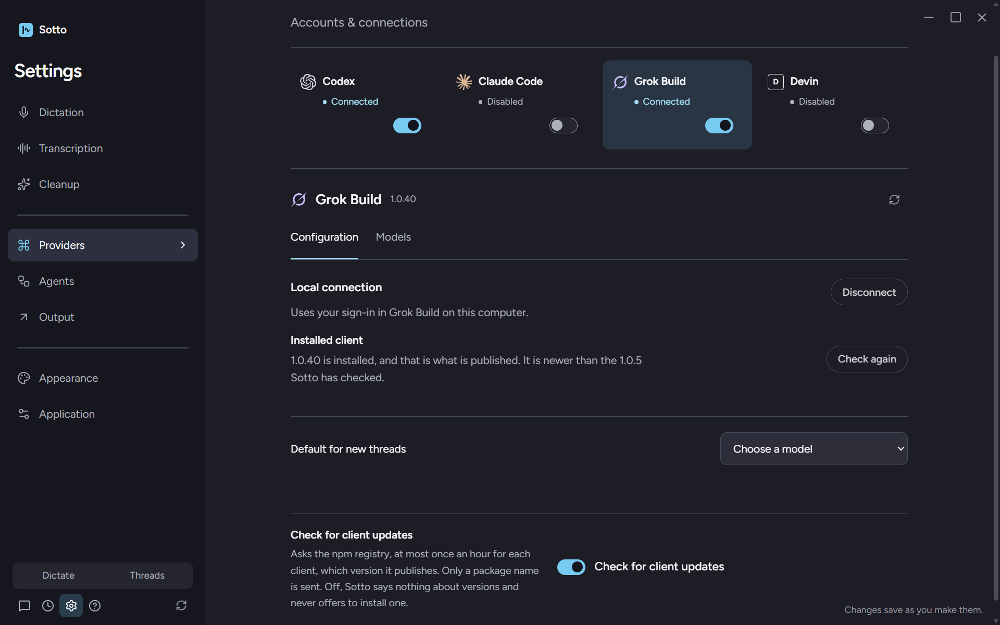

# Client updates, and the pins that blocked them

Evidence for `docs/adr/0020-provider-client-updates.md` and `docs/plans/2026-09-21-provider-client-updates.md`. Windows 11, 2026-09-21. The built app was run on a throwaway user-data folder, since deleted, so nothing here touched the real profile; the clients and their sign-ins are the machine's own, which is why connecting worked at all.

## What the machine and the registry said, before

| Client | Installed | `latest` on registry.npmjs.org | Channel found |
| --- | --- | --- | --- |
| Claude Code | 2.1.278 | 2.1.278 (`@anthropic-ai/claude-code`) | its own installer, `~/.local/bin/claude.exe` |
| Codex | 0.155.1 | 0.155.1 (`@openai/codex`) | npm global, vendored binary inside the package |
| Grok Build | 1.0.5 | 1.0.40 (`@xai-official/grok`) | npm global, binary in `~/.grok/bin` |
| Devin | not installed here | not asked | the Devin app |

Grok was 35 patch releases behind, and Sotto's exact pin was what kept it there: connecting to 1.0.40 would have failed with "requires Grok CLI 1.0.5".

## What running it found

Four things that tests could not have found, because each one was a fact about this machine rather than about the code.

1. **The registry answers 406 to the header the check sent.** `accept: application/vnd.npm.install-v1+json` is the abbreviated packument type, valid on `/<package>` and refused on `/<package>/latest`. Every check failed with "Sotto could not reach the registry to see what is published", which is the right sentence for the wrong reason. The check now sends `application/json`, and a test pins the header by answering 406 to anything else.
2. **Codex's version is inside a user agent.** The app server reports `sotto/0.155.1 (Windows 10.0.26200; x86_64) unknown (sotto; 1.0)` — its version, the OS's, and Sotto's own. Taking the first token read the installed version as `sotto`. It now reads the product's own version out of a user agent, and falls back to the first version-shaped run of digits.
3. **npm owns a client whose binary lives somewhere else.** Grok Build resolves to `~/.grok/bin/grok.exe`, 142 MB with no `node_modules` anywhere near it, so it was read as a client that updates itself. `grok update` then answered `Error: program not found`, and `grok update --check --json` explained why: `{"currentVersion":"1.0.5","latestVersion":null,"installer":"npm","error":"program not found"}`. The client says npm installed it, and its own updater cannot find npm. Detection now asks the npm global root as well as the path, so Grok reads as npm; only a client npm does not own updates itself.
4. **`cmd /s /c` loses its quoting.** Running `cmd /d /s /c "C:\…\npm.cmd" install -g …` answered `operable program or batch file.` — the tail of "is not recognized as an internal or external command". npm now runs as `npm-cli.js` under this process's own Node through `ELECTRON_RUN_AS_NODE`: no shell, no quoting.

## What then happened, in the running app

With those four fixed, the card appeared in the corner of the real window with the real reading:

```
grok  installed 1.0.5  published 1.0.40  behind  channel npm  command "npm install -g @xai-official/grok@latest"
codex installed 0.155.1 published 0.155.1 current
```


Pressing **Update** disconnected Grok, ran npm, and reconnected:


The install worked. `~/.grok/bin/` gained `grok-1.0.40.exe`, `grok.exe` became the new binary with the old one kept as `grok.exe.old`, and `grok.exe --version` answered `grok 1.0.40 (eb1a2256660d)`.

**But the app still reported 1.0.5 after reconnecting**, because a Grok leader process from before the update was still alive and answered for it. The card said "Clients updated · Now 1.0.5", which is a lie the user can check by looking at the version beside it. That is the fifth finding, and the reason the reading now has an `unchanged` outcome: when the installer finishes and the version does not move, the card says "A client did not change · The update ran, but this client is the one still open", names the version it is still on, and says to close other windows and connect again.

On the next launch, with no stale leader, the app connected to the new client:

```
grok  connected  "1.0.40 / ACP 1"  verifiedVersion "1.0.5"
grok  installed 1.0.40  published 1.0.40  behind false
```



That last line is the pin change proved live: **Sotto is running a Grok client the old exact pin would have refused**, it says so ("It is newer than the 1.0.5 Sotto has checked"), and a read-only ACP `initialize` against 1.0.40 confirms the protocol it was checked against — ACP 1, `cached_token`, and the same catalog with `grok-4.7` current.

The machine was left on the published version: package `@xai-official/grok` 1.0.40, binary 1.0.40. The "Clients updated" card is the one state with no photograph; it needs a second behind client, and re-staging one by downgrading leaves the installer's own copies behind rather than a clean 1.0.5.

## What the tests prove

`tests/unit/main/providerClientUpdates.test.ts` (20): 1.0.5 reads as older than 1.0.40, which a string compare gets backwards; the client's own version is found in a protocol note and in a user agent; the registry is asked as plain JSON, once an hour, cached in between; an unreachable registry and an unreadable version claim nothing; Devin is never asked about; npm is recognised from a vendored binary, from a package beside the launcher, and from the global root when the binary lives elsewhere; bun and Homebrew are named rather than driven; an update refuses while a thread works and proceeds when forced; the order is disconnect, install, reconnect; a failed install keeps the version, reports the installer's last line and restores the connection; an install that changes nothing reports `unchanged`; a client that will not reconnect still reports the install; the check holds nothing while it is off; and an install runs on the provider lane, leaving `globalLaneBusy` false.

`tests/unit/renderer/clientUpdateCard.test.tsx` (7) and three cases in `tests/unit/renderer/providersSettings.test.tsx` cover the card's states, the working-thread wording and its `force`, the command-instead-of-a-button row, Escape, and the settings line with its switch.

`tests/integration/grokAdapterFailures.test.ts` and `tests/integration/devinPolicyBoundary.test.ts` hold the version contract against the fake providers: older than checked is refused before `authenticate`, another protocol version is refused, and a newer client (Grok 1.0.40, Devin 3000.11.02) connects and reports both versions.

## Gates

`npm run typecheck`, `npm run lint`, `npm run notices:verify` and `node scripts/release-external-dependencies.mjs` pass. The full suite run is recorded in the pull request.
