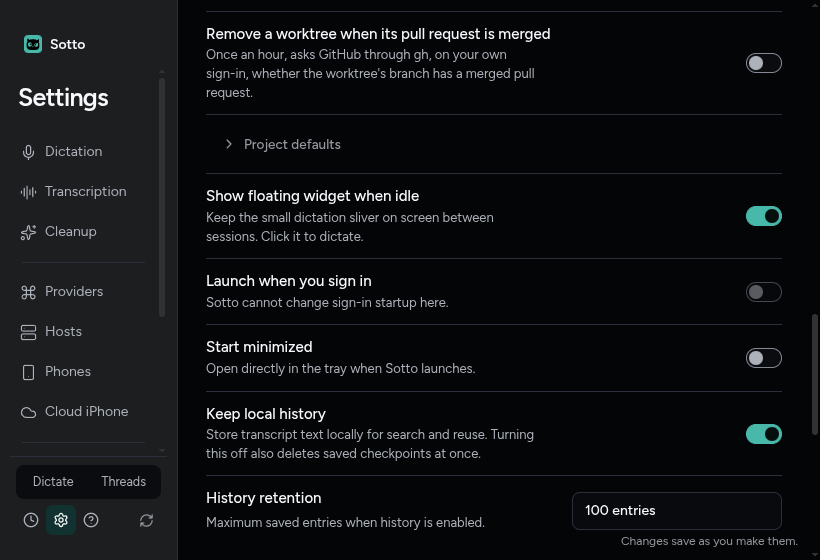
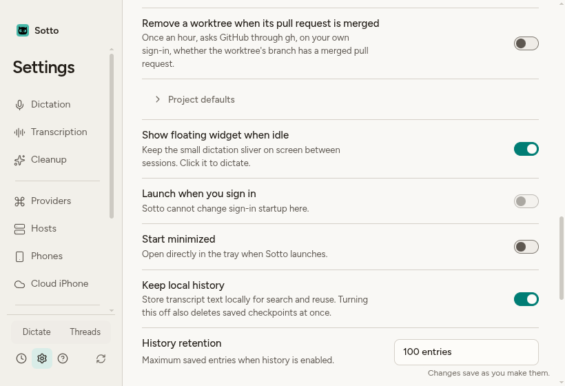

# Package Sotto for Omarchy

Verified on forge, October 9, 2026, for #841, under the accepted Linux desktop decision (ADR-0062). The branch is `feat/linux-package`; merge commit `96892f8f` records `origin/main` at `f77c40f2`, already an ancestor, without changing the tree. Node is 24.21.0, Electron is 43.1.0, and the local package version is 0.1.34. No system package was installed, no sudo command or real install command was run, and nothing was published. The owner installs the local verification package separately.

## What was checked

The initial pass ran `npm ci`, `node node_modules/electron/install.js` and `npm run runtime:prepare` through `mise exec node@24.21.0 --`. This bot review pass reused that setup and ran every Node command through the same pinned version. Builds and test suites ran one at a time; Vitest used two workers and Playwright one. The shared electron-builder keys, Windows block and macOS block compare equal to the base. `npmRebuild` remains false; only the Linux command adds `--config.npmRebuild=true`. Main changes are confined to login items and startup; the quit-drain registration is byte-for-byte the same as origin/main. No shell plugin files changed.

The final four gates and the main/preload external allowlist output are retained in [gates.txt](../../artifacts/linux-package/gates.txt). Typecheck and lint passed. Vitest passed 629 files and 9,312 tests, with 50 files and 182 tests skipped (679 files, 9,494 tests total), in 529.83 seconds. Notices verification checked 174 components, and the external allowlist printed `allowlist check: PASS`. A final build-input comparison matched the packaged digest. The normal unit gate covers the Linux profile, isolated smoke environment, complete archive comparison, a tarball missing its WASM resource while its ASAR is unchanged, packaged autostart write/remove and disabled development startup. Existing Windows/macOS profiles and the false shared rebuild setting remain pinned.

The Linux hicolor icons now come from `scripts/generate-brand-assets.mjs`. The `--linux` pass renders 48, 128 and 256 pixels from the master SVG on forge; all 16 existing Windows/macOS/phone output hashes remained identical. Full regeneration needs the original platform fonts and rendering libraries, so its unrelated output was restored before the scoped pass. The recipe’s icon hashes and `.SRCINFO` were refreshed, and that review advanced the package revision to 2. The bot fixes below use revision 3 for the refreshed app and install helper.

The first full run found a base-branch defect: the owl mark and Linux desktop ADRs both used 0062. The owl decision was renumbered to 0064, with its glossary and historical verification references updated; neither decision changed. PR #873 was still open when main was incorporated, so this branch retains its renumbering and now corrects the missed prototype citation too. `ls docs/adr | cut -c1-4 | sort | uniq -d` printed nothing, and the unique-number test passed.

## Linux archive

`npm run package:linux` completed successfully in an owned nested Hyprland. It produced:

- `release/linux-unpacked/sotto`
- `release/Sotto-0.1.34-linux-x64.tar.gz`

The [complete verifier result](../../artifacts/linux-package/package-verification.json) records identical embedded and unpacked ASAR hashes and 254 checked tarball files. This compares external resources, native modules, all nine access permission bits on files and directories (including the archive root), and links. Extraction preserves archive modes rather than applying the verifier’s umask. Seven regression cases reject changes to file execute/read/write and directory read/write/traverse permissions. The package’s chrome-sandbox ownership and setuid check remains separate. The normal packaged launch loaded the worklet and local WASM. SQLite 3.53.1 migrated to version 4, matched the probe row and passed FTS5. The bundled PTY exited 0 with `SOTTO_PTY_PACKAGE_OK` (Electron modules 148, N-API 10). Release smoke probes used isolated HOME/XDG configuration and `--password-store=basic`.

This is a local verification build, not a published release. Provenance records source commit `7f5344795666c6453d91dba87c730d66e91fcd32` and build-input digest `bd1746107db8b1ccc63cedf4ca3f09f4a24cdc72eeec85bc932e60c1f9baa409`. The final implementation has those same packaged inputs. A release owner must rebuild from a reviewed clean commit and replace the initial recipe checksum with that release's archive checksum.

## Real packaged launch and autostart

`scripts/verify-linux-package.mjs` uses main inspector port 9348, renderer CDP port 9349, an isolated HOME/configuration and a short private runtime folder inside this worktree. The shorter runtime path keeps the Unix socket below its path-length limit. The real session bus is retained for Secret Service and the tray. It never saves a key.

The unpacked and extracted app both reported ready, packaged, encryption available and `gnome_libsecret`. The tray entry's D-Bus connection PID matched the launched process. [proof.json](../../artifacts/linux-package/proof.json) retains both results; [proof.txt](../../artifacts/linux-package/proof.txt) retains the concise output and cleanup records.

Onboarding was driven from Get started through Finish setup, with optional steps skipped, followed by the Threads tour and Settings → Application. Space on **Launch when you sign in** wrote the isolated `autostart/sotto.desktop`. `desktop-file-validate` accepted it, and forge's systemd XDG autostart generator produced `app-sotto@autostart.service` pointing at that packaged executable. Clicking the switch off removed the file. Forge's existing uwsm session has `xdg-desktop-autostart.target` active and its `wayland-session-xdg-autostart@.target` binds to it. No live sign-in configuration was changed and no session was restarted.

The packaged Settings row was checked in dark and light, with reduced motion, at 1600×1000, 1280×800 and 820×560. Its control fits, the page has no horizontal overflow, and its existing focus treatment and accessible name work. Electron's Wayland native minimum adds 20 pixels to the requested minimum: a normal instance stops at 840×580. The inspector lowers only the test window's minimum to 800×540 so the renderer is actually measured at 820×560. Production window code is unchanged.

Curated 820×560 captures, opened and inspected:


All GUI runs used `scripts/with-nested-hyprland.mjs`. It identified the live signature from quickshell, created a distinct compositor, validated ownership and scoped window operations to it. Wrapped commands receive neither the live DISPLAY nor XAUTHORITY, and the scope runner preserves the supplied environment without merging those credentials back in. Two regression tests and a real scoped command confirmed this isolation. It stopped its processes and removed only its own instance folder. Existing agents may stop their own nested displays concurrently; the wrapper checks that the live instance identity is preserved. No compositor key events reached the live locked session.

## Pacman package and launcher

The dependency list follows `pacman -Si t3code-bin` on forge (0.0.42-2), adding wl-clipboard and libsecret. All archive and package-source checksums passed. A local absolute archive path is converted to a `file://` source, retaining the same required SHA-256 verification as the release URL.

```sh
cd apps/omarchy
SOTTO_TARBALL="$PWD/../../release/Sotto-0.1.34-linux-x64.tar.gz" makepkg --cleanbuild --force
```

`makepkg` produced `apps/omarchy/sotto-bin-0.1.34-3-x86_64.pkg.tar.zst`. [package-list.txt](../../artifacts/linux-package/package-list.txt) records the selected `pacman -Qlp` paths and the complete `bsdtar -tvf` permission listing. A separate archive-header audit matched 290 shipped file/directory access modes against linux-unpacked, confirmed every entry is root-owned, and found chrome-sandbox to be the only setuid/setgid entry. The package contains `/opt/sotto`, `/opt/sotto/bin/sotto`, `/usr/bin/sotto`, the desktop entry and 48, 128 and 256 pixel hicolor icons. Its launcher is the existing #858 launcher, unchanged. The PATH link targets `/opt/sotto/bin/sotto`; `chrome-sandbox` is root:root 4755.

The package was extracted into `artifacts/linux-package/bot-extracted-root`. Its `/opt/sotto/bin/sotto` launcher started the packaged executable, and the same launcher ran `dictation toggle` with exit 0 against that instance's private socket. This exercised bundled Electron in Node mode and the client inside `resources/app.asar`; no separate Node install was used by the launcher. A rootless extraction cannot preserve the helper's root ownership, so this launch alone passed `--disable-setuid-sandbox`, retaining Chromium's user namespace sandbox. The installed package retains the required root-owned helper.

Local checksums are also written to `release/SHA256SUMS.txt`:

```text
2a0c29b3a79f7fea239d20ecb33dcc20a3be5d3b01cc90397be3f05e3166a326  Sotto-0.1.34-linux-x64.tar.gz
aeb4969c2728926a083afb58a7da01f08f5a1e51d55e84743c2d01890877bdf4  sotto-bin-0.1.34-3-x86_64.pkg.tar.zst
```

The owner can install from the laptop:

```sh
ssh -t zach@forge 'sudo pacman -U /home/zach/Projects/Sotto/.worktrees/linux-package/apps/omarchy/sotto-bin-0.1.34-3-x86_64.pkg.tar.zst'
```

Linux shutdown drain is deferred to #871, which needs a Linux handler that requests logind’s delay.

Real pacman installation, a fresh sign-in, dictation with an OpenRouter key and AUR/release publication remain owner release actions. The optional install helper was syntax checked and exercised with `</dev/null` using a PATH containing only stubs. Both optional prompts defaulted to no and the helper exited 0; no real install command ran. It installs a local package, a repository package or the eventual AUR package, then offers bindings and separate shell-plugin instructions. Shell plugin delivery is #850's work.

## Desktop journeys and review

This pass ran `linux-platform-profile.spec.ts` and `linux-dictation-command.spec.ts`: four tests passed, one worker, in 14.8 seconds, on an owned nested display. The earlier review also checked the quit/relaunch journey in `app.spec.ts`; this pass did not run that spec. The dictation spec initially timed out because it still expected the old six-step setup. It now walks the nine steps using the shared helpers and retains the keyboard finish, layout checks and every dictation command assertion. Its deadline is unchanged. Captures that these specs regenerate outside this ticket’s evidence folder were restored, The earlier review restored `artifacts/review-quit-drain/before-quit.png` after `app.spec.ts` rewrote it; that file was untouched in this pass.

The diff was reviewed once against AGENTS.md and once against #841 and ADR-0062. Shared packaging settings, runtime dependencies, provider authority, startup gating, launcher paths, checksums and documentation were checked. The Linux build keeps the Windows/macOS paths unchanged. The real package and launcher checks establish the new layout; they do not claim a system installation or published download.

## Review fixes

- `5897cb3a` restores main’s shutdown registration and leaves Linux shutdown policy to #871.
- `782be9d4` removes live X11 credentials from nested commands and prevents the scope merge from restoring them.
- `d7ca83a0` compares real file/directory access permissions and preserves them during extraction.
- `ea2948d2` puts the Linux icons in the generator, refreshes their hashes and advances pkgrel to 2.
- `1779e85a` points the first-run prototype at ADR-0064; `96892f8f` records the main merge baseline.

All of this pass’s proof scopes stopped, with no recorded PIDs or cgroup members left running. The final note, source metadata, checksums and curated evidence are committed separately after verification.

## Bot review fixes for PR #875

- `ffabb5b4` contains Linux autostart read, write and removal errors in the adapter. Only `linux-autostart-read-failed` or `linux-autostart-write-failed` is logged. Startup continues; Settings disables the unavailable control and says Sotto cannot change it here. Windows and macOS keep their adapters and behavior.
- `1b21f667` marks entries with `X-Sotto-Autostart=true` and reconciles the packaged Linux setting even when already on. An owned stale command is refreshed at startup; startup off removes an owned stale entry. Unmarked entries, other names, `Hidden=true` and `X-GNOME-Autostart-enabled=false` are preserved. The guide describes this behavior.
- `869f883a` adds `TryExec` with the same path, using Desktop Entry string escaping. Owned entries missing it are refreshed. The Omarchy guide explains that uninstall leaves the user entry and startup off removes it first.
- `36fbe2b9` removes fixed pkgrel 1 examples from all three requested documents. Recipe-built files come from `makepkg --packagelist`; downloaded packages use a glob.
- `eaeb81e3` defaults both optional install-helper reads to no at EOF, tests the no-input path with installation stubs and refreshes the helper checksum. Package revision 3 identifies the changed output.

The packaged regression helper completed ten isolated launches after real onboarding was driven in the normal packaged journey. EACCES and EISDIR each passed with remembered startup off and on. A read-only autostart directory also passed with startup on. Each failure left the app running, logged only the expected stable event and disabled Settings. An already-on owned stale entry was rewritten with the current Exec and TryExec, then removed through Settings. Unmarked, differently named and externally disabled entries remained byte-identical. The case results are in `proof.json`; the successful scoped output and cleanup are in `proof.txt`.

The unavailable row was checked in dark and light with reduced motion at 1600×1000, 1280×800 and 820×560, using the same renderer viewport matrix as the Linux e2e specs. The normal packaged journey independently passed all six native-window measurements. The first capture attempts exposed floating-window rounding and pending renderer layout; the helper now clears inherited CDP metrics and waits for two animation frames before measuring. Inspector PID checks prevent either packaged proof from driving a different app. These verification changes are `7f534479` and `f350f3c6`; they do not change packaged inputs.

The two unavailable-row captures were opened and inspected. The control and explanation fit without horizontal overflow:





VERIFIED: the current unpacked and extracted builds reached ready with gnome_libsecret and a tray registered to their own PID. Settings wrote and removed the marked Exec/TryExec entry, the XDG generator accepted it, and the extracted launcher sent dictation toggle with exit 0. Both archive outputs and the revision 3 package passed verification. Every proof scope stopped with no recorded PIDs or cgroup members left. The final packaged-input digest still matches the current source. No sudo, system installation, publishing or PR comment was performed.
