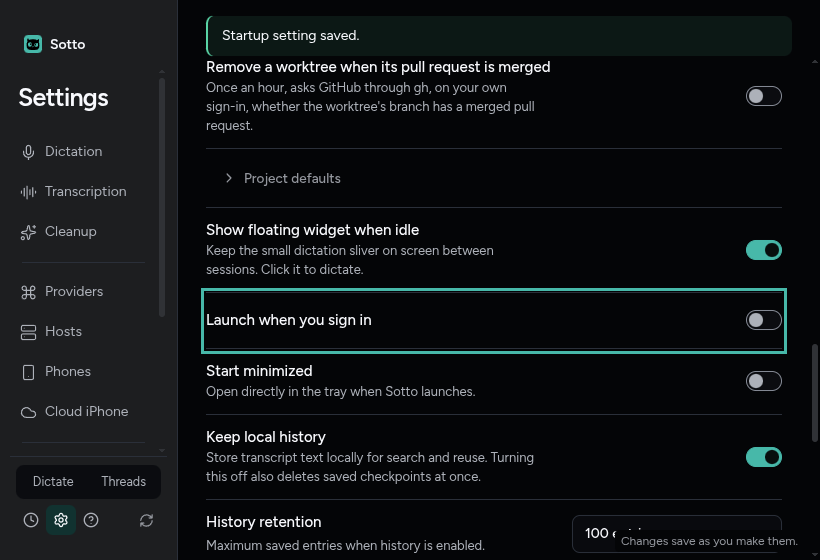
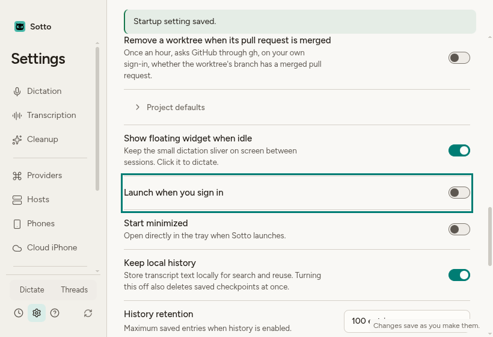

# Package Sotto for Omarchy

Verified on forge, October 9, 2026, for #841, under the accepted Linux desktop decision (ADR-0062). The branch is `feat/linux-package`, based on `f77c40f2`. Node is 24.21.0, Electron is 43.1.0, and the local package version is 0.1.34. No system package was installed, no sudo command or install helper was run, and nothing was published. The owner installs the local verification package separately.

## What was checked

`npm ci`, `node node_modules/electron/install.js` and `npm run runtime:prepare` were run through `mise exec node@24.21.0 --`. Builds and test suites ran one at a time; Vitest used two workers and Playwright one. The shared electron-builder keys, Windows block and macOS block compare equal to the base. `npmRebuild` remains false; only the Linux command adds `--config.npmRebuild=true`. Main changes are confined to login items and startup; the quit-drain registration is byte-for-byte the same as origin/main. No shell plugin files changed.

The final four gates and the main/preload external allowlist output are retained in [gates.txt](../../artifacts/linux-package/gates.txt). Typecheck and lint passed. Vitest passed 627 files and 9,289 tests, with 50 files and 182 tests skipped (677 files, 9,471 tests total), in 507.67 seconds. Notices verification checked 174 components, and the external allowlist printed `allowlist check: PASS`. A final build-input comparison matched the packaged digest. The normal unit gate covers the Linux profile, isolated smoke environment, complete archive comparison, a tarball missing its WASM resource while its ASAR is unchanged, packaged autostart write/remove and disabled development startup. Existing Windows/macOS profiles and the false shared rebuild setting remain pinned.

The first full run found a base-branch defect: the owl mark and Linux desktop ADRs both used 0062. The owl decision was renumbered to 0064, with its glossary and historical verification references updated; neither decision changed. The unique-number test passes after that fix.

## Linux archive

`npm run package:linux` completed successfully in an owned nested Hyprland. It produced:

- `release/linux-unpacked/sotto`
- `release/Sotto-0.1.34-linux-x64.tar.gz`

The [complete verifier result](../../artifacts/linux-package/package-verification.json) records identical embedded and unpacked ASAR hashes and 254 checked tarball files. This compares external resources, native modules, executable permissions and links, not just the ASAR. The normal packaged launch loaded the worklet and local WASM. SQLite 3.53.1 migrated to version 4, matched the probe row and passed FTS5. The bundled PTY exited 0 with `SOTTO_PTY_PACKAGE_OK` (Electron modules 148, N-API 10). Release smoke probes used isolated HOME/XDG configuration and `--password-store=basic`.

This is a verification build of the ticket's working tree, not a publishable clean release. Provenance records source commit `2cfcc754be1dfb5d01d7bd9f99396038ce3c0d03` and build-input digest `6f7be9ae3568b731b5f5dfa8cba7c617ec55bc041f7d424cd3ba827fdc03285e`. The final implementation has those same packaged inputs. A release owner must rebuild from a reviewed clean commit and replace the initial recipe checksum with that release's archive checksum.

## Real packaged launch and autostart

`scripts/verify-linux-package.mjs` uses main inspector port 9348, renderer CDP port 9349, an isolated HOME/configuration and a short private runtime folder inside this worktree. The shorter runtime path keeps the Unix socket below its path-length limit. The real session bus is retained for Secret Service and the tray. It never saves a key.

The unpacked and extracted app both reported ready, packaged, encryption available and `gnome_libsecret`. The tray entry's D-Bus connection PID matched the launched process. [proof.json](../../artifacts/linux-package/proof.json) retains both results; [proof.txt](../../artifacts/linux-package/proof.txt) retains the concise output and cleanup records.

Onboarding was driven from Get started through Finish setup, with optional steps skipped, followed by the Threads tour and Settings → Application. Space on **Launch when you sign in** wrote the isolated `autostart/sotto.desktop`. `desktop-file-validate` accepted it, and forge's systemd XDG autostart generator produced `app-sotto@autostart.service` pointing at that packaged executable. Clicking the switch off removed the file. Forge's existing uwsm session has `xdg-desktop-autostart.target` active and its `wayland-session-xdg-autostart@.target` binds to it. No live sign-in configuration was changed and no session was restarted.

The packaged Settings row was checked in dark and light, with reduced motion, at 1600×1000, 1280×800 and 820×560. Its control fits, the page has no horizontal overflow, and its existing focus treatment and accessible name work. Electron's Wayland native minimum adds 20 pixels to the requested minimum: a normal instance stops at 840×580. The inspector lowers only the test window's minimum to 800×540 so the renderer is actually measured at 820×560. Production window code is unchanged.

Curated 820×560 captures, opened and inspected:





All GUI runs used `scripts/with-nested-hyprland.mjs`. It identified the live signature from quickshell, created a distinct compositor, validated ownership and scoped window operations to it. It stopped its processes and removed only its own instance folder. Existing agents may stop their own nested displays concurrently; the wrapper checks that the live instance identity is preserved. No compositor key events reached the live locked session.

## Pacman package and launcher

The dependency list follows `pacman -Si t3code-bin` on forge (0.0.42-2), adding wl-clipboard and libsecret. All archive and package-source checksums passed. A local absolute archive path is converted to a `file://` source, retaining the same required SHA-256 verification as the release URL.

```sh
cd apps/omarchy
SOTTO_TARBALL="$PWD/../../release/Sotto-0.1.34-linux-x64.tar.gz" makepkg --cleanbuild --force
```

`makepkg` produced `apps/omarchy/sotto-bin-0.1.34-1-x86_64.pkg.tar.zst`. [package-list.txt](../../artifacts/linux-package/package-list.txt) records the selected `pacman -Qlp` paths and the `bsdtar -tvf` ownership/modes. The package contains `/opt/sotto`, `/opt/sotto/bin/sotto`, `/usr/bin/sotto`, the desktop entry and 48, 128 and 256 pixel hicolor icons. Its launcher is the existing #858 launcher, unchanged. The PATH link targets `/opt/sotto/bin/sotto`; `chrome-sandbox` is root:root 4755.

The package was extracted into `artifacts/linux-package/extracted-root`. Its `/opt/sotto/bin/sotto` launcher started the packaged executable, and the same launcher ran `dictation toggle` with exit 0 against that instance's private socket. This exercised bundled Electron in Node mode and the client inside `resources/app.asar`; no separate Node install was used by the launcher. A rootless extraction cannot preserve the helper's root ownership, so this launch alone passed `--disable-setuid-sandbox`, retaining Chromium's user namespace sandbox. The installed package retains the required root-owned helper.

Local checksums are also written to `release/SHA256SUMS.txt`:

```text
9600c3948ef9739b1b5a3186e4c8471367561d3dcb7b4122843380abc74b5f09  Sotto-0.1.34-linux-x64.tar.gz
ebcbc52c3d9810de3bcd3778e1c1d41d9f11a9519b8ad2351c75ef548b0eb152  sotto-bin-0.1.34-1-x86_64.pkg.tar.zst
```

The owner can install from the laptop:

```sh
ssh -t zach@forge 'sudo pacman -U /home/zach/Projects/Sotto/.worktrees/linux-package/apps/omarchy/sotto-bin-0.1.34-1-x86_64.pkg.tar.zst'
```

Linux shutdown drain is deferred to #871, which needs a Linux handler that requests logind’s delay.

Real pacman installation, a fresh sign-in, dictation with an OpenRouter key and AUR/release publication remain owner release actions. The optional install helper was syntax checked only. It installs a local package, a repository package or the eventual AUR package, then offers bindings and separate shell-plugin instructions. Shell plugin delivery is #850's work.

## Desktop journeys and review

Both `linux-platform-profile.spec.ts` and `linux-dictation-command.spec.ts` passed: four tests, one worker, in 14.3 seconds. The dictation spec initially timed out because it still expected the old six-step setup. It now walks the nine steps using the shared helpers and retains the keyboard finish, layout checks and every dictation command assertion. Its deadline is unchanged. Captures that these specs regenerate outside this ticket's evidence folder were restored; `app.spec.ts` was not run and `before-quit.png` was untouched.

The diff was reviewed once against AGENTS.md and once against #841 and ADR-0062. Shared packaging settings, runtime dependencies, provider authority, startup gating, launcher paths, checksums and documentation were checked. The Linux build keeps the Windows/macOS paths unchanged. The real package and launcher checks establish the new layout; they do not claim a system installation or published download.
