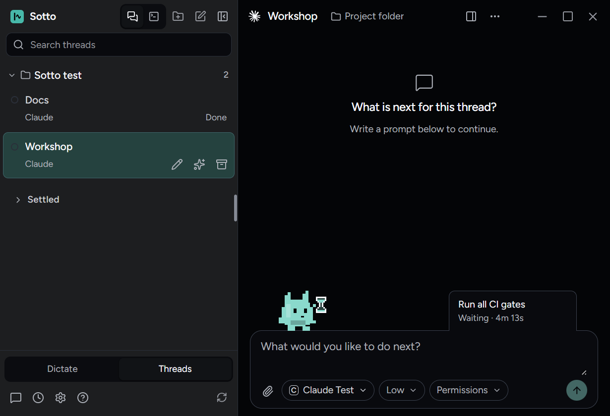
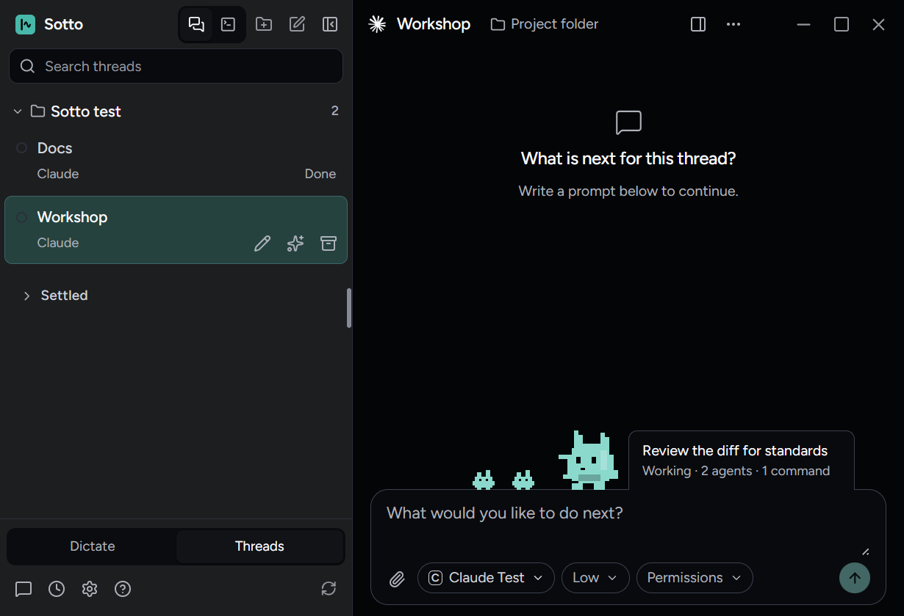
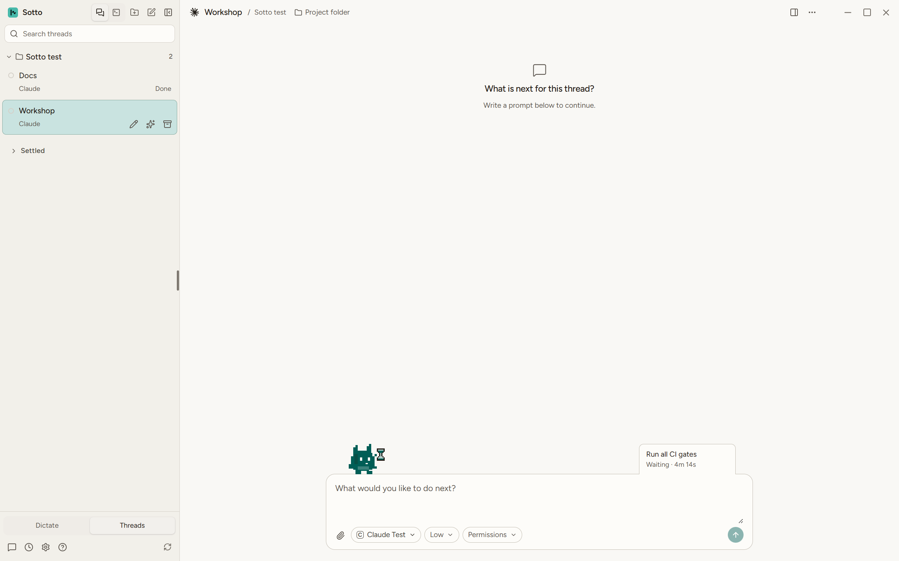

# Background command verification

September 25, 2026, on `feat/background-shell-waiting` from `main` at 9a04ae98. While a Claude Code thread waited
on a test suite it had sent to the background, Sotto showed nothing, because ADR-0023 left `local_bash` tasks
inert. Zach asked for them to show as **Waiting**. He chose the timing, the label, the order against agents and
the reaper rule in conversation, and variant A of the throwaway prototype on `prototype/background-shell`
(`docs/prototypes/background-shell-prototype.html`), which stays off `main`. ADR-0023 carries the amendment; the
glossary's **Background work** entry is amended.

## What the provider sends

Captured live once with Claude Code 2.1.282 in an empty temporary folder outside the repo, `--model haiku
--output-format stream-json --verbose --allowedTools Bash`, with a prompt that ran `sleep 3` with
`run_in_background` and asked for the single word *done*. The capture was read and deleted; only these frames'
fields were kept (session and output-file fields dropped):

- `{ type: "system", subtype: "task_started", task_id, tool_use_id, description: "Sleep for 3 seconds in the
  background", is_backgrounded: true, task_type: "local_bash" }`. The `tool_use_id` is the root Bash call and the
  description is the one Claude wrote for that call, which is what the readout names.
- `{ subtype: "task_updated", task_id, patch: { status: "completed", end_time } }`, then `{ subtype:
  "task_notification", task_id, tool_use_id, status: "completed" }`. Either ends it.

A shell the turn is still running carries `is_backgrounded: false` (`tests/unit/main/nativeActivity.test.ts`
records that shape), so it stays the turn's own held action, as a foreground subagent does.

## In the running app

`tests/e2e/thread-monitoring.spec.ts`, "a command left running after the turn waits with the hourglass", against
the built app with the design fixture's Claude thread:

- A command in the background of an idle thread holds the hourglass: the readout names *Run all CI gates* and
  reads *Waiting · 4m 13s*, counting from its start. The creature stands on the composer.
- Two agents beside it take the track: *Working · 2 agents · 1 command*, two small agents out. The readout gets a
  wider column only when it counts commands, and every readout is one line; the first run of this test caught the
  combined readout wrapping at 172px, which pushed the creature 9px into the composer.
- Dark and light at 1600x1000, 1280x800 and 820x560 under reduced motion: the pose is whole and inside the window,
  and the combined readout is not clipped at any size. Contrast of the readout on its surface (`contrast.json`):
  label 18.97:1 and status 9.20:1 dark, 16.29:1 and 6.95:1 light.
- The end frame takes it down and the composer has its room back.

The session reaper holding a session with a background command is covered in
`tests/integration/claudeMonitoring.test.ts` against the fake Claude CLI. The refusal of settings changes and
rewinds reads the same `backgroundWork` list and is tested there with an agent.
