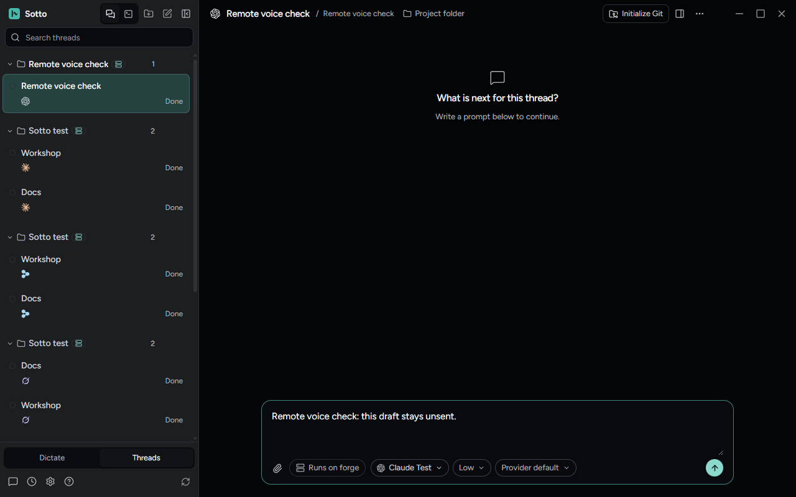

# Disabled voice coordinator on remote threads

October 9, 2026: Voice control and thread management described below are historical under [ADR-0062](../adr/0062-remove-voice-control-and-thread-management.md); the original plan or evidence is retained.

Verified on Windows on October 5, 2026, against main at `7453a2e5`.

## Failure and cause

Opening a remote thread could show “This action is not allowed from this device. Check its permission policy or complete the action on the host.” without sending anything. The renderer created a coordinator voice session even with `voiceCoordinatorEnabled: false`. Switching between hosts with different wake-model folders stopped that session, publishing a `voice-state` command through the newly selected remote host. The remote allow-list correctly refuses that local-only command.

The coordinator now creates no session while its setting is off or still loading. Voice controls and callbacks also respect that setting. Disposing a session preserves its pending microphone release so another audio owner cannot start early. Remote permissions and the allow-list are unchanged.

## Reproduction

`tests/unit/renderer/disabledCoordinatorVoice.test.tsx` uses the real renderer provider, desktop router and remote allow-list. Local and remote cases cover clients both with and without permission to answer host requests.

`tests/e2e/disabled-coordinator-remote.spec.ts` uses the built desktop and a real headless-host socket behind scripted SSH and providers. Local wake folders differ from the remote host's folders. The test selects a local thread, then opens the remote thread and checks the actual banner without issuing a command that would clear it.

The same Electron test fails with the exact permission banner when the base `AgentContext.tsx` is injected into a separate baseline build. It passes against the fixed build. No remote permission was relaxed to make it pass.

## Native Computer Use

An isolated built Electron window, titled “Sotto disabled voice verification”, used a temporary profile and synthetic remote host. With the coordinator off, Computer Use opened the remote thread from a local thread, clicked its composer and typed an unsent draft. The remote thread opened without the banner, and the draft appeared and remained unsent.

The harness then independently read the active remote thread ID, a null error, zero error banners and the exact draft `Remote voice check: this draft stays unsent.` It saved [the 1280×800 capture](../../artifacts/disabled-coordinator-voice/remote-thread-native-1280x800.png). The fixture and its host were closed and its temporary profile removed.

This verifies the Windows renderer journey with scripted providers and a real host socket. It does not test physical microphone hardware, macOS, or enabled voice on a remote host. The installed desktop and Forge host were not updated or restarted. No appearance baseline changed.

## Neighboring behavior

The focused voice and audio-ownership checks pass (54 tests). The enabled-voice and disabled-remote Electron journeys both pass (2 tests). The enabled journey covers wake, composing and pausing a prompt, sending, mute/unmute, widget dictation and turning the coordinator off. Its old close-button locator depended on the original thread title; the same failure reproduced in the baseline build after the thread named itself. The test now closes the open thread dialog regardless of its generated title.

PR review caught one additional regression: recreating a session lost its previous mute. The provider now retains the session's actual mute state before disposing it and restores that state before a replacement can listen. Four regression cases failed before this follow-up and pass after it: button and spoken mute, each with immediate and delayed microphone shutdown. Each case also checks that an explicit unmute resumes listening.

## Standards review

Sonnet 5.5 at max reasoning found no blocking standards issue on the final source. The follow-up resolved the plain-language and evidence comments. The parent also reviewed the integrated change. Suggestions to refactor the wider provider or share more fixture code were left outside this focused fix.

## Spec review

Sonnet 5.5 at max reasoning found no remaining confirmed blocking issue. Review added explicit checks for settings still loading, commands during disable, and re-enabling before microphone release, with and without a personal-audio owner. An initial concern about rejected capture shutdown was withdrawn after tracing the production error handling. Enabled remote voice remains outside this fix; its host-local status commands may still be refused by the remote allow-list.
