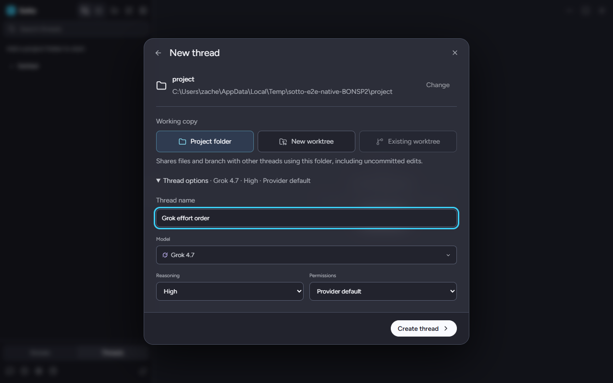
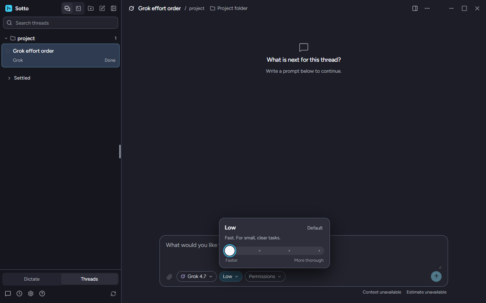
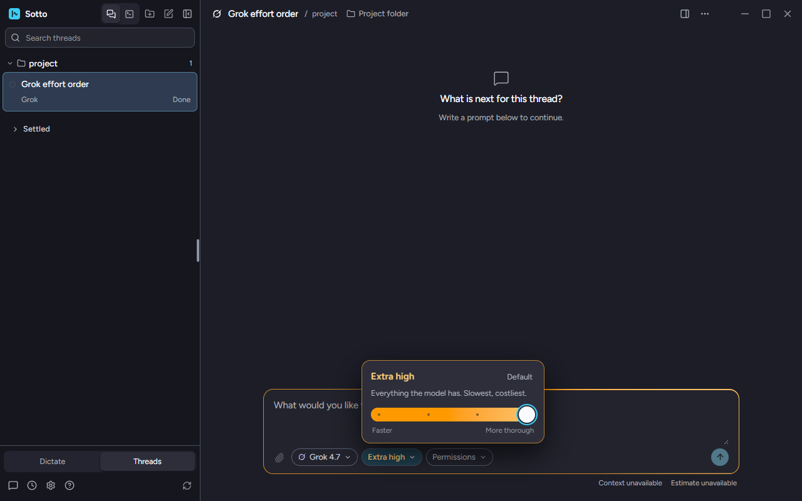
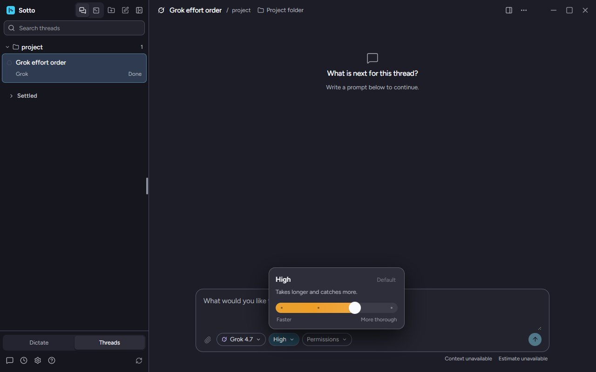

# Grok's effort levels run lowest first, and Default is Grok's default

September 22, 2026, Windows 11, Grok CLI 1.0.41 signed in to its own subscription, the built app from
`fix/grok-effort-order` (#223). The app ran from the test-only entry point the native Threads smoke uses
(`tests/fixtures/nativeThreadsMain.cjs`): production main and the real Grok adapter, with a fresh profile
and project folder under the temp directory, so the user's own Sotto profile was not touched. Only Grok
was connected. A thread was created and no prompt was sent, so no turn ran.

## What the adapter hands over

The same installed client, read through `GrokAcpHost.connect()` with the adapter from `main` and then from
this branch:

| Model | `main`: levels, default | This branch: levels, default |
| --- | --- | --- |
| grok-4.7 | xhigh, high, medium, low; xhigh | low, medium, high, xhigh; high |
| grok-4.7-build-fast | xhigh, high, medium, low; high | low, medium, high, xhigh; high |
| grok-4.6 | xhigh, high, medium, low; high | low, medium, high, xhigh; high |
| grok-4.5 | high, medium, low; high | low, medium, high; high |

On `main` the list is Grok's own, highest first. Grok 4.7's default on `main` is Extra high because this
machine's Grok settings put that model's session there, while Grok flags High as its default. That is the
difference ADR-0023 decides.

## In the running app

- **New thread** lists Grok 4.7's levels Low, Medium, High, Xhigh and starts on High.
  
- On the new thread's effort card, Home puts the thumb at the left under "Faster" on Low, and the chip is
  not at the highest level.
  
- End puts it at the right under "More thorough" on Extra high. Only there do the card, the chip and the
  composer's outline take the effort color (`data-effort-top="true"`).
  
- **Default** is titled "Use Grok 4.7's default, High" and returns the thread to High, which is saved.
  

New terminal was not opened. It lists levels through the same `ThreadOptionFields` as New thread, and
`tests/unit/renderer/threadOptions.test.tsx` pins that list's order.

## Not shown here

A thread created with no level (the Agents view's new-thread form, a coordinator dispatch) is covered by
`tests/integration/grokAdapter.test.ts` against the fake Grok agent, not in the running app.
