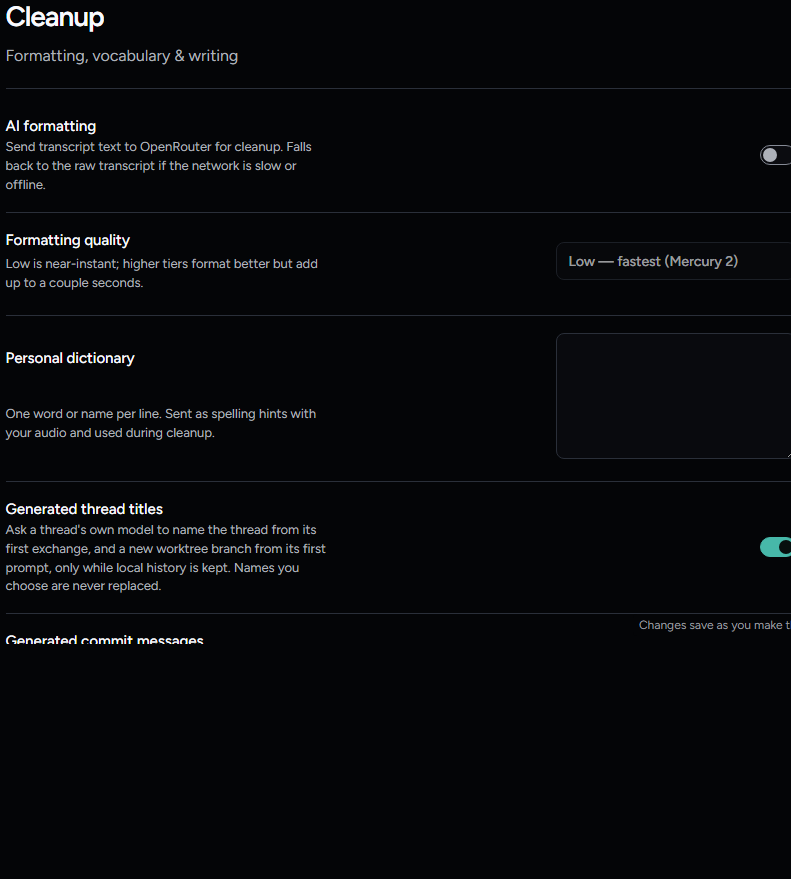

# Short writing on the thread's own provider: a live check

September 22, 2026, Windows 11, from `feat/short-writing-on-the-thread-provider` (#256, ADR-0026) rebased on the main that carries the Forge host (#181), against the
clients installed and signed in on the development machine: Claude Code 2.1.280, Codex 0.156.0 and Grok 1.0.41.

## What was run

```sh
SOTTO_SIDE_WRITING_LIVE=1 npx vitest run tests/integration/sideWritingLive.test.ts --maxWorkers=1 --reporter=verbose --silent=false
```

For each client the test builds the production stack in a fresh temporary folder (the real adapter inside
`SottoThreadHost`, `ConfiguredProviderHost`, `WorkspaceHost` and `AgentControl`), with the coordinator's
title writer wired exactly as `src/main/index.ts` wires it: `threadTitleWriter` over a `ShortTextWriter` whose
side call is `WorkspaceHost.writeShortText`. It creates one project and one thread named "New thread", sends
one harmless prompt, "In one sentence, what does a README file in a code repository usually hold? Do not use
tools, read files or run commands.", opens the thread the way the window does (`observe-threads`), and waits
for the coordinator to rename it with a `generated` title. Then it checks:

- no short-writing failure was logged;
- the thread's own transcript, read back from its client after a refresh, holds that one prompt as its only
  user message and nothing of the title instruction;
- no file the client keeps and wrote during the run holds the side call's material: the whole of
  `~/.claude` and `~/.claude.json` for Claude Code (session files, prompt history and settings), the whole of
  `CODEX_HOME` for Codex (sessions, archived sessions, prompt history and its state, thread-history and log
  databases, read in chunks because the logs run to gigabytes), and the whole of `~/.grok` for Grok. The
  prompt carries a reference made fresh for the run, and the search is for that prompt under the
  "First message:" heading only the side call gives it, so no other session or earlier run can match;
- nothing under Sotto's data folder written during the run holds the title instruction's first sentence or
  that material;
- for Grok, the side call's throwaway home, which holds the call's session while it runs, is gone when the
  call ends. The check cannot read that home mid-call, so what it proves for Grok is that the real `~/.grok`
  never holds the side call and the throwaway one does not outlive it.

Claude Code ran on the Haiku model, Grok on its Fast model, and Codex on the model it recommends, because
Codex lists mini models a ChatGPT sign-in cannot use.

## Result

The first run searched only each client's session folder (`~/.claude/projects`, `~/.codex/sessions`,
`~/.grok/sessions`) for the instruction's first sentence:

| Client | Model | Title written | Time from start to title |
| --- | --- | --- | --- |
| Claude Code 2.1.280 | Haiku 4.5 | "README file contents" | 22 s |
| Codex 0.156.0 | GPT-6-Astra | "Explain what a repository README contains" | 11 s |
| Grok 1.0.41 | Grok 4.7 Fast | "What a README file usually contains" | 9 s |

After review the check was widened to the stores above, and the Codex side call gained the reasoning
path's full set of switches and an empty `notify`. The run after those changes:

| Client | Model | Title written | Time from start to title |
| --- | --- | --- | --- |
| Claude Code 2.1.280 | Haiku 4.5 | "README file overview" | 17 s |
| Codex 0.156.0 | GPT-6-Astra | "Explain what a repository README contains" | 12 s |
| Grok 1.0.41 | Grok 4.7 Fast | "What a README file usually holds" | 10 s |

Both runs passed every check they made: 3 tests, 3 passed each time. The times include starting the client,
the thread's own turn and the side call.

## What the first runs found

- **A thread whose reply streamed in was never named.** Real clients show the first reply while the turn
  is still running and end the turn on a later frame that adds no message. The coordinator recorded the
  message count on the running frame, found no exchange yet, and then skipped the finishing frame because
  the count had not changed. The unit tests never saw it because their fake answered and went idle in one
  frame. `AgentControl.generateTitles` now leaves a running thread unchecked, and
  `tests/unit/main/threadTitles.test.ts` covers the streamed case. This was true on `main` too; the loop is
  unchanged there apart from the thread ID now passed to the writer.
- **Codex says its own warnings as `error` items.** `codex exec --json` reports an unknown model's metadata
  or a feature still in development as an `item.completed` of type `error` before the turn. The first
  version read every item that was not a message as a tool and stopped the call. Those items are now
  allowed and the fake Codex emits one. (The first version also stopped passing the in-development
  skill-discovery switch, which only adds such a warning; after review the side call passes it again, with
  the rest of the switches the reasoning path uses.)
- **The models answered the material instead of naming it.** With the prompt "Reply with the single word
  ready", Claude Code and Grok both titled the thread "ready", and Grok answered the README question in full.
  Each job's instruction now says to treat its material as something to describe, not instructions, and
  Grok's side call carries the instruction in the turn as well as the system prompt.

## Settings

Settings → Cleanup no longer has a Writing model field, and the three Generated switches say the thread's own
model writes. The `settings-cleanup` design baseline was retaken on purpose for that change alone; the other
captures `npm run design:capture` rewrote were put back, and `node scripts/verify-design-captures.mjs`
verifies all 144 tuples.


