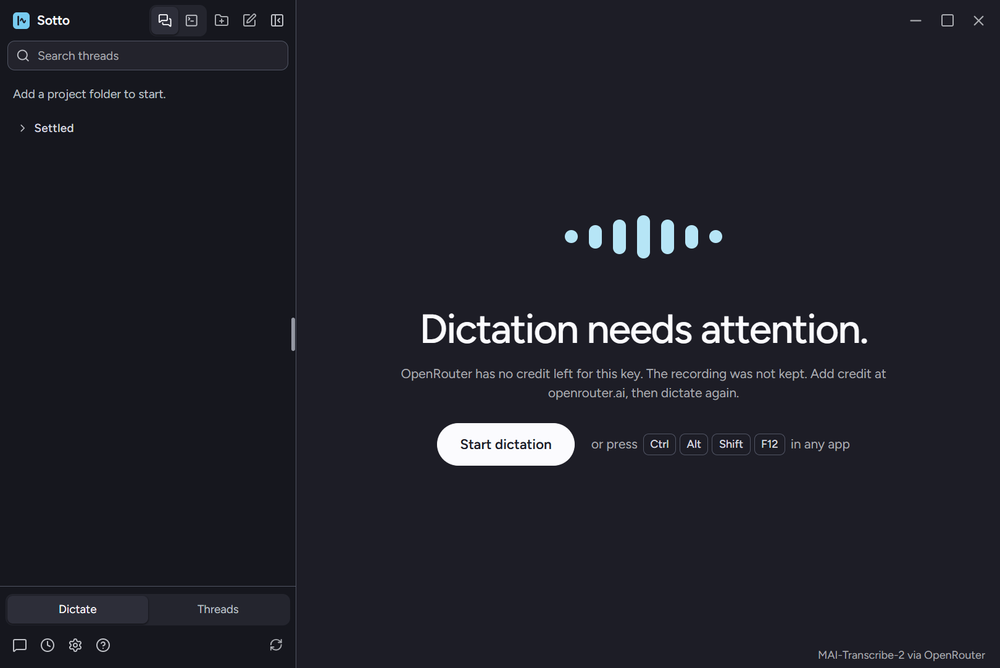

# Transcription failures: each reason says what happened, and a failed request leaves a record

September 22, 2026, Windows 11, the built app from `fix/transcription-failure-reasons` (#220). Each run used
a fresh isolated profile (`--user-data-dir`), a synthesized voice clip as the microphone through Chromium's
fake capture device, streaming transcription on, and auto-paste, auto-copy and history off, so nothing
reached another window, the clipboard or the user's own profile.

## What set this off

On 0.1.14 the user saw **Couldn't transcribe** on longer dictations. OpenRouter accepted the key, the
balance had credit, and Sotto's exact request succeeded for clips from 0.01 s to 20 s. The installed
0.1.14 in an isolated profile finished a 14 s streamed dictation. With the running app instrumented over
IPC (reasons only, never text), the user's own 12 s and 30 s dictations also succeeded. The failure did not
recur while watched, and five different reasons had shared that one sentence, so which one happened could
not be recovered. That is what this change fixes.

## Each reason in the running app

`badkey` is a real request: a made-up key, so OpenRouter itself answered 401. For the others main's
transcription answer was replaced with the reason, since a real 402, 429 or 5xx cannot be produced on
demand. The service-level mapping from HTTP status to reason is covered by
`tests/unit/main/openRouterTranscriptionService.test.ts`.

| Reason | Widget title | Sentence (tooltip, announcement, Dictate room) | Capsule |
| --- | --- | --- | --- |
| `unauthorized` (real 401) | API key rejected | OpenRouter rejected the API key. The recording was not kept. Check the key in Settings. |  |
| `billing` | Out of credit | OpenRouter has no credit left for this key. The recording was not kept. Add credit at openrouter.ai, then dictate again. |  |
| `rate-limited` | Too many requests | OpenRouter is limiting requests on this key. The recording was not kept. Wait a minute, then dictate again. |  |
| `http` | OpenRouter error | OpenRouter's transcription service returned an error. The recording was not kept. Dictate again in a moment. |  |
| `malformed` | Couldn't transcribe | Sotto did not get usable text back. The recording was not kept. Dictate again. |  |

Every title fits the 212 px capsule without an ellipsis. The Dictate room shows the same sentence under
**Dictation needs attention.**:



## The record

The real 401 run left one line in the profile's `transcription-diagnostics.jsonl`:

```json
{"at":1790114287554,"reason":"unauthorized","status":401,"attempts":1,"audioMs":3691,"elapsedMs":390}
```

No words, no audio, no key. The injected runs left no line, as expected, because they never reached the
service that writes it.
